# HomeFeed: server calls and user actions in OutSystems and React

This file compares the route `/UBTConnect/HomeFeed` in OutSystems (TST) with the React app.
The tool `migration/tools/route_actions/check_route.py` wrote this file on 2026-11-04.
The tool reads the code. It does not run the app.

The app shell is the same on many routes: layout, app start, bottom bar, PIN lock and shared dialogs.
[APP_SHELL.md](APP_SHELL.md) has it. This file does not.

## 1. Route

| Item | Value | Source |
|---|---|---|
| Route | `/UBTConnect/HomeFeed` | `app/src/app/routes.generated.ts` |
| OutSystems screen | `UBTConnect.Home.HomeFeed` | TST compiled code |
| UI flow | `Home` | MCP `getScreenNames` (DEV) |
| React screen | [`pages/HomeFeed/HomeFeedPage.tsx`](../../app/src/pages/HomeFeed/HomeFeedPage.tsx) | `app/src/pages/` |
| React route rules | access `member`, lock `enforce`, flag redirect none | `app/src/app/routes.ts` |
| Code read | OutSystems: 31 screen and block files of the route, 34 app shell files. React: 228 screen files | TST `facts.json`, `react_calls.mjs` |

## 2. Result

| Check | Result |
|---|---|
| Server calls of the route on TST | 14: React makes 11, **3 missing** |
| User actions of the route | 23 diagrams (one per action and option) |
| React calls of the screen that TST does not make | 2 (see [questions](#8-questions)) |
| Screen and blocks with a React port | 31 of 31 |
| Navigation targets found in React | 15 of 15 |
| App shell on this route | 9 calls, 3 user actions: see [APP_SHELL.md](APP_SHELL.md) |

## 3. Screenshots

The screenshots come from the last parity run (`route.py parity`). The TST capture hides personal text with dots. The React build shows fictional mock data.

| State | TST (expected) | React (build) | Difference |
|---|---|---|---|
| `default` 390x844, mock `real` 2026-10-29 pixel difference 0.0% | 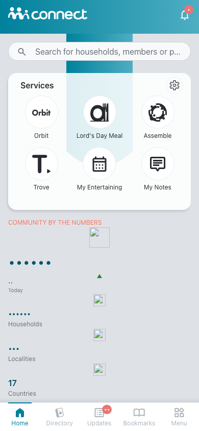 | 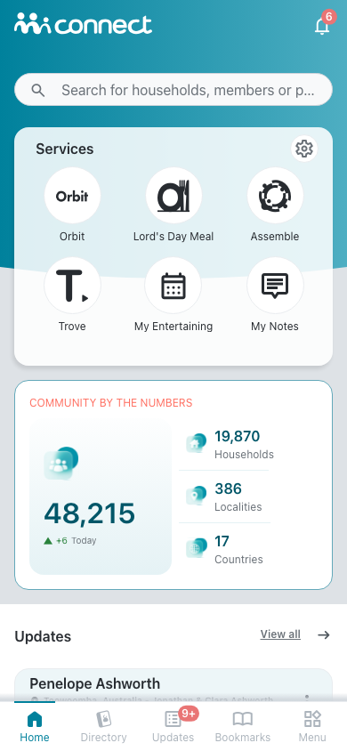 | 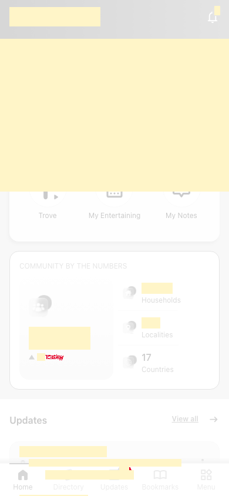 |
| `loading` 390x844, mock `loading` 2026-10-29 pixel difference 0.0% | 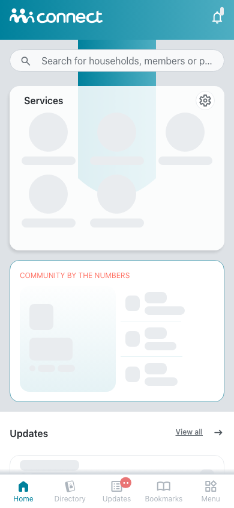 | 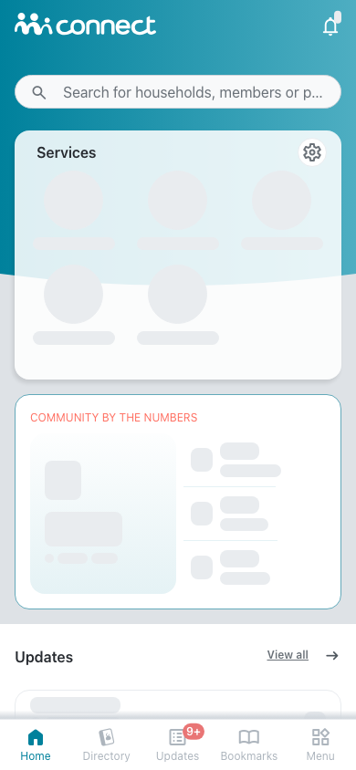 | 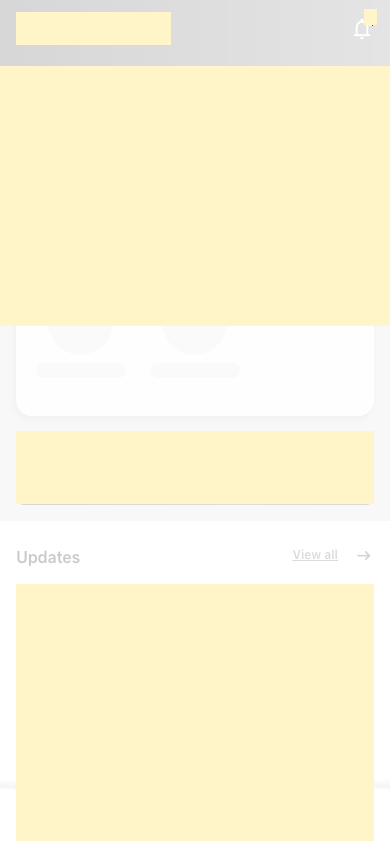 |
| `offline` 390x844, mock `error` 2026-10-29 pixel difference 0.0% | 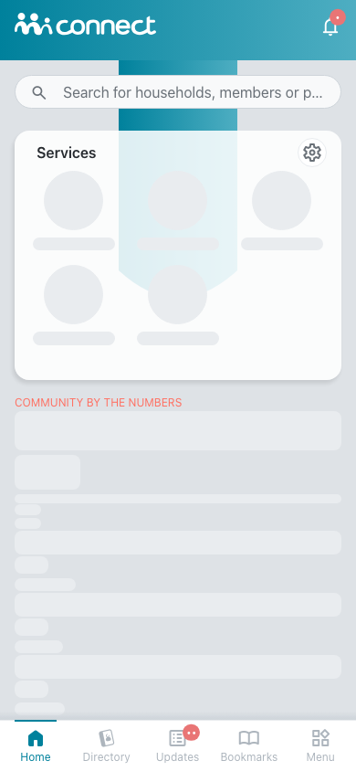 | 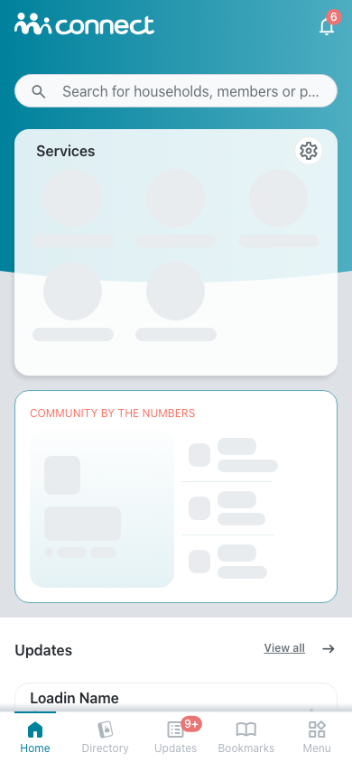 | 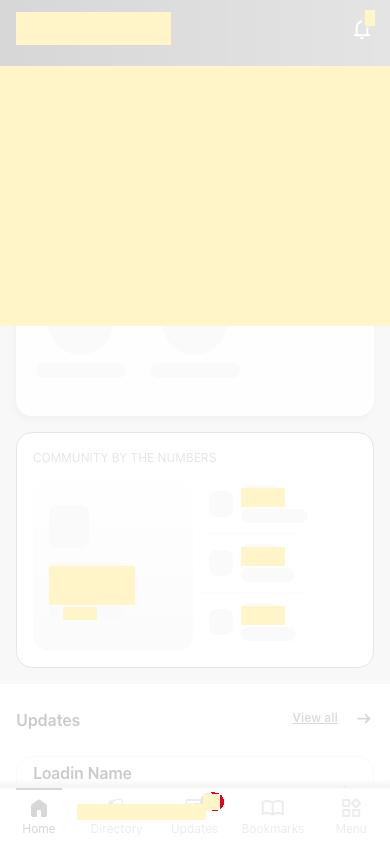 |

## 4. Diagram

- A box on the left is the OutSystems block of the route that makes the call.
- A line connects each call to the React action that makes the same call.
- The right column shows the React components that use each React action.
- A red box is a call that React does not make.

Mermaid source

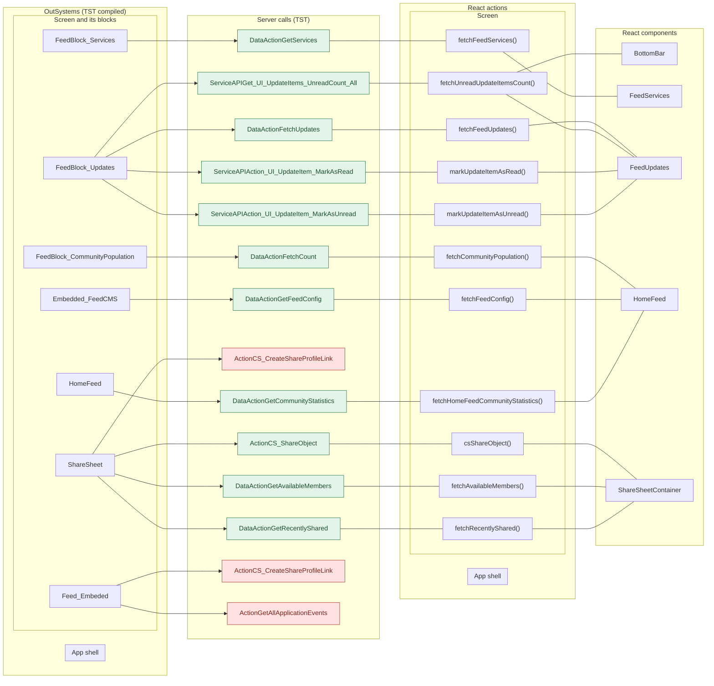
```mermaid
flowchart LR
  subgraph OS["OutSystems (TST compiled)"]
    subgraph OS_shell["App shell"]
    end
    subgraph OS_screen["Screen and its blocks"]
      o0["Embedded_FeedCMS"]
      o1["FeedBlock_CommunityPopulation"]
      o2["FeedBlock_Services"]
      o3["FeedBlock_Updates"]
      o4["Feed_Embeded"]
      o5["HomeFeed"]
      o6["ShareSheet"]
    end
  end
  subgraph EP["Server calls (TST)"]
    e7["DataActionGetFeedConfig"]
    e8["DataActionGetCommunityStatistics"]
    e9["DataActionFetchUpdates"]
    e10["DataActionFetchCount"]
    e11["DataActionGetServices"]
    e12["ServiceAPIAction_UI_UpdateItem_MarkAsRead"]
    e13["ServiceAPIAction_UI_UpdateItem_MarkAsUnread"]
    e14["ActionCS_CreateShareProfileLink"]
    e15["ActionCS_ShareObject"]
    e16["DataActionGetAvailableMembers"]
    e17["DataActionGetRecentlyShared"]
    e18["ServiceAPIGet_UI_UpdateItems_UnreadCount_All"]
    e19["ActionCS_CreateShareProfileLink"]
    e20["ActionGetAllApplicationEvents"]
  end
  subgraph RE["React actions"]
    subgraph RE_shell["App shell"]
    end
    subgraph RE_page["Screen"]
      r21["csShareObject()"]
      r22["fetchAvailableMembers()"]
      r23["fetchCommunityPopulation()"]
      r24["fetchFeedConfig()"]
      r25["fetchFeedServices()"]
      r26["fetchFeedUpdates()"]
      r27["fetchHomeFeedCommunityStatistics()"]
      r28["fetchRecentlyShared()"]
      r29["fetchUnreadUpdateItemsCount()"]
      r30["markUpdateItemAsRead()"]
      r31["markUpdateItemAsUnread()"]
    end
  end
  subgraph RC["React components"]
    c32["BottomBar"]
    c33["FeedServices"]
    c34["FeedUpdates"]
    c35["HomeFeed"]
    c36["ShareSheetContainer"]
  end
  r23 --- c35
  r24 --- c35
  r27 --- c35
  r26 --- c34
  r29 --- c34
  r30 --- c34
  r31 --- c34
  r25 --- c33
  r21 --- c36
  r22 --- c36
  r28 --- c36
  r29 --- c32
  o0 --> e7
  o5 --> e8
  o3 --> e9
  o3 --> e12
  o3 --> e13
  o3 --> e18
  o1 --> e10
  o2 --> e11
  o6 --> e14
  o6 --> e15
  o6 --> e16
  o6 --> e17
  o4 --> e19
  o4 --> e20
  e7 --- r24
  e8 --- r27
  e9 --- r26
  e10 --- r23
  e11 --- r25
  e12 --- r30
  e13 --- r31
  e15 --- r21
  e16 --- r22
  e17 --- r28
  e18 --- r29
  classDef missing fill:#fde2e1,stroke:#c0392b,color:#7b241c
  classDef ok fill:#e3f4e8,stroke:#2e7d4f,color:#1d4d31
  class e14,e19,e20 missing
  class e7,e8,e9,e10,e11,e12,e13,e15,e16,e17,e18 ok
```

## 5. User actions

Each user action (click, change, submit) has its own sequence diagram below.
The diagrams follow the OutSystems code on TST. The participant is the OutSystems block. The action is its screen action.

- The effects are server calls, navigation (`Navigation`), external links, messages and confirm dialogs.
- When the handler has branches (a menu option, for example), each branch has its own diagram.
- The name of a branch comes from its condition in the TST code. `other` is the last `else`.
- A note `via …` gives the module action that makes the next calls.
- An arrow to the server gives the inputs of the call. The return arrow gives the outputs. The names come from the contract `app/src/api/openapi.yaml`.
- Each call arrow ends with the nearest React component that makes the same call (`React: …`). A red area is a call that React does not make.

| # | Block (OutSystems) | User action | Handler | Option (branch) | Effects |
|---|---|---|---|---|---|
| [1](#51-feed_embeded-click-handle_share_others) | `Feed_Embeded` | click | `handle_Share_Others` | – | calls **GetAllApplicationEvents (missing)**, **CS_CreateShareProfileLink (missing)**, AppManager_SynchAppContext |
| [2](#52-feed_embeded-click-handle_share_connect) | `Feed_Embeded` | click | `handle_Share_Connect` | – | goes to LegacyShareObject |
| [3](#53-dialog_goexternalapp-click-gotoexternalapp) | `Dialog_GoExternalApp` | click | `goToExternalApp` | – | opens an external link |
| [4](#54-app_notificationicon-click-iconclick) | `App_NotificationIcon` | click | `iconClick` | – | goes to Notifications, MessageList |
| [5](#55-feedblock_updates-click-event_listitemonclick) | `FeedBlock_Updates` | click | `event_ListItemOnClick` | – | calls Action_UI_UpdateItem_MarkAsRead; goes to HouseholdCarousel, HouseholdDetails; asks for a confirmation |
| [6](#56-feedblock_communitypopulation-click-onclick_block) | `FeedBlock_CommunityPopulation` | click | `onClick_Block` | – | goes to Updates_SingleList |
| [7](#57-feedblock_updates-click-event_markasread) | `FeedBlock_Updates` | click | `event_MarkAsRead` | – | calls Action_UI_UpdateItem_MarkAsRead, Get_UI_UpdateItems_UnreadCount_All |
| [8](#58-feedblock_updates-click-event_markasunread) | `FeedBlock_Updates` | click | `event_MarkAsUnread` | – | calls Action_UI_UpdateItem_MarkAsUnread, Get_UI_UpdateItems_UnreadCount_All |
| [9](#59-feedblock_updates-click-event_sendgift) | `FeedBlock_Updates` | click | `event_SendGift` | – | shows a message |
| [10](#510-feedblock_services-click-onclick_servicesettings) | `FeedBlock_Services` | click | `onClick_ServiceSettings` | – | goes to Services |
| [11](#511-feedblock_services-click-onclick_service-orbit) | `FeedBlock_Services` | click | `onClick_Service` | `orbit` | goes to OrbitLanding |
| [12](#512-feedblock_services-click-onclick_service-ldm) | `FeedBlock_Services` | click | `onClick_Service` | `lDM` | goes to LDM_MyEvents_V2, LDM_MyEvents |
| [13](#513-feedblock_services-click-onclick_service-mycalendar) | `FeedBlock_Services` | click | `onClick_Service` | `myCalendar` | goes to MyEntertaining |
| [14](#514-feedblock_services-click-onclick_service-assemble) | `FeedBlock_Services` | click | `onClick_Service` | `assemble` | goes to AssembleEvents |
| [15](#515-feedblock_services-click-onclick_service-orbitadmin) | `FeedBlock_Services` | click | `onClick_Service` | `orbitAdmin` | goes to OrbitAdminLanding |
| [16](#516-feedblock_services-click-onclick_service-mynotes) | `FeedBlock_Services` | click | `onClick_Service` | `myNotes` | goes to Notes |
| [17](#517-feedblock_services-click-onclick_service-other) | `FeedBlock_Services` | click | `onClick_Service` | `other` | asks for a confirmation |
| [18](#518-sharesheet-click-handler_onclickexternaloption) | `ShareSheet` | click | `handler_OnClickExternalOption` | – | calls **CS_CreateShareProfileLink (missing)** |
| [19](#519-sharesheet-click-handler_onclickrecentmember) | `ShareSheet` | click | `handler_OnClickRecentMember` | – | calls CS_ShareObject; shows a message; asks for a confirmation |
| [20](#520-homefeed-click-onclick_search) | `HomeFeed` | click | `onClick_Search` | – | goes to Search |
| [21](#521-homefeed-click-section_updatesonclick_viewall) | `HomeFeed` | click | `section_UpdatesOnClick_ViewAll` | – | goes to Updates_SingleList |
| [22](#522-sharesheet-submit-handler_inputeventsubmit) | `ShareSheet` | submit | `handler_InputEventSubmit` | – | calls GetAvailableMembers |
| [23](#523-sharesheet-click-handler_onclicksend) | `ShareSheet` | click | `handler_OnClickSend` | – | calls CS_ShareObject; shows a message |

### 5.1 Feed_Embeded: click handle_Share_Others

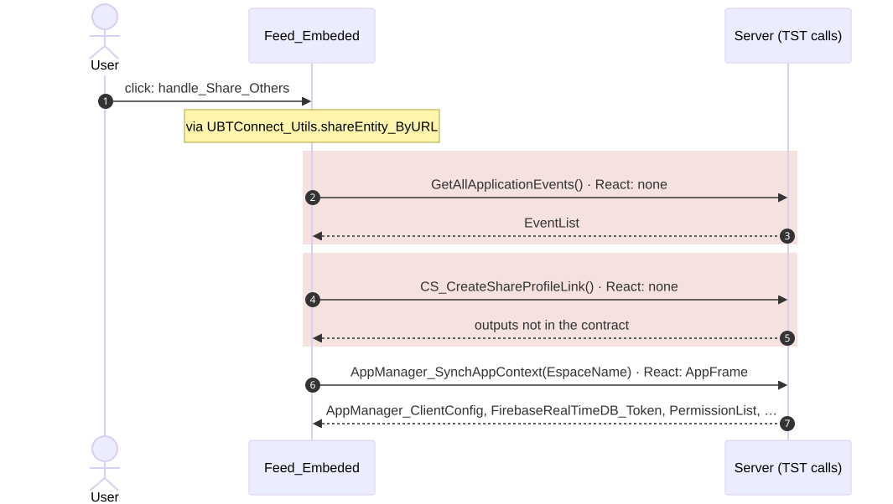

Mermaid source

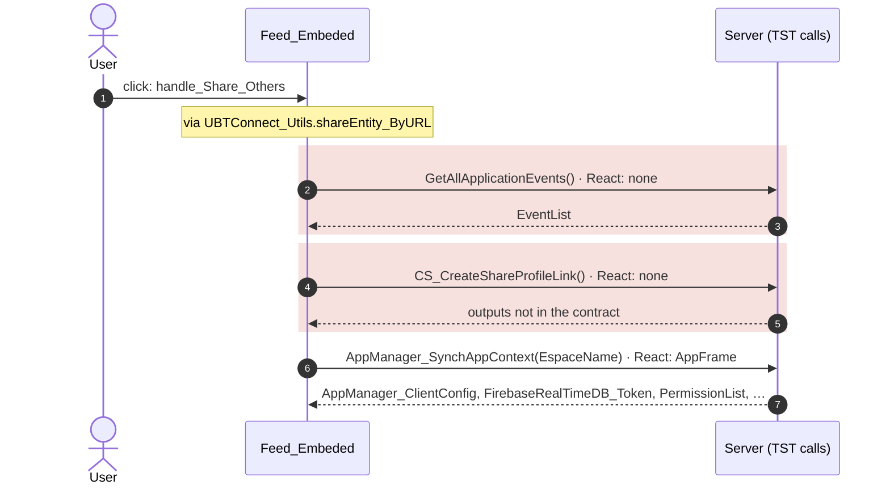
```mermaid
sequenceDiagram
  autonumber
  actor U as User
  participant B as Feed_Embeded
  participant S as Server (TST calls)
  U->>B: click: handle_Share_Others
  Note over B: via UBTConnect_Utils.shareEntity_ByURL
  rect rgba(192, 57, 43, 0.15)
  B->>S: GetAllApplicationEvents() · React: none
  S-->>B: EventList
  end
  rect rgba(192, 57, 43, 0.15)
  B->>S: CS_CreateShareProfileLink() · React: none
  S-->>B: outputs not in the contract
  end
  B->>S: AppManager_SynchAppContext(EspaceName) · React: AppFrame
  S-->>B: AppManager_ClientConfig, FirebaseRealTimeDB_Token, PermissionList, …
```

### 5.2 Feed_Embeded: click handle_Share_Connect

Mermaid source

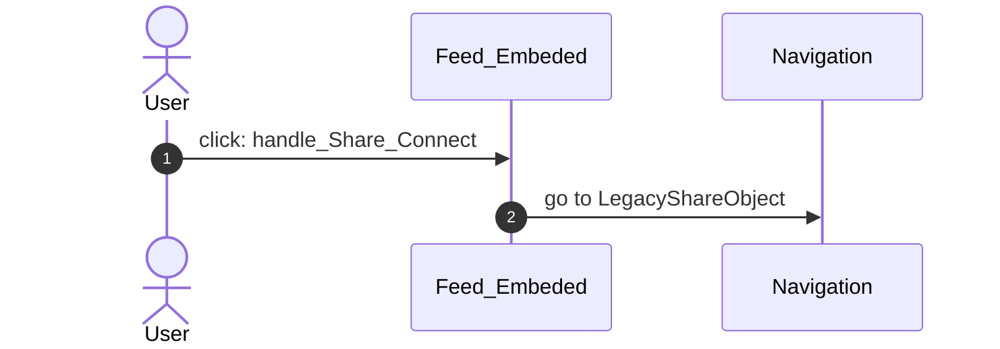
```mermaid
sequenceDiagram
  autonumber
  actor U as User
  participant B as Feed_Embeded
  participant N as Navigation
  U->>B: click: handle_Share_Connect
  B->>N: go to LegacyShareObject
```

### 5.3 Dialog_GoExternalApp: click goToExternalApp

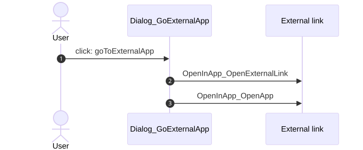

Mermaid source

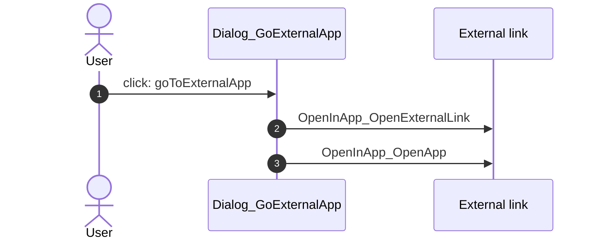
```mermaid
sequenceDiagram
  autonumber
  actor U as User
  participant B as Dialog_GoExternalApp
  participant X as External link
  U->>B: click: goToExternalApp
  B->>X: OpenInApp_OpenExternalLink
  B->>X: OpenInApp_OpenApp
```

### 5.4 App_NotificationIcon: click iconClick

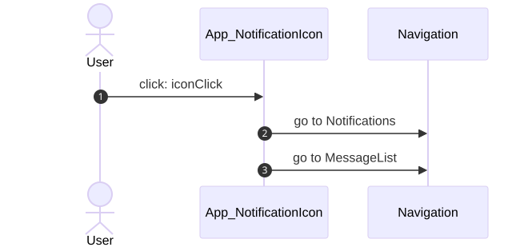

Mermaid source

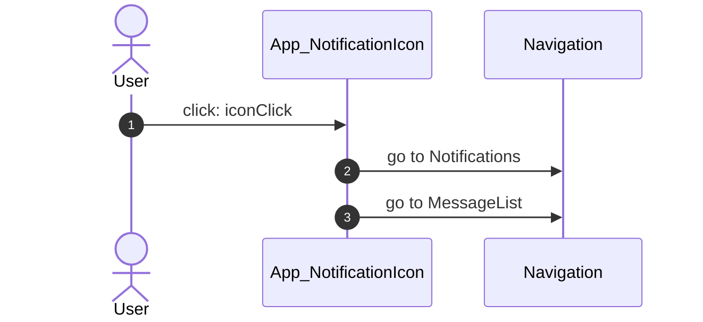
```mermaid
sequenceDiagram
  autonumber
  actor U as User
  participant B as App_NotificationIcon
  participant N as Navigation
  U->>B: click: iconClick
  B->>N: go to Notifications
  B->>N: go to MessageList
```

### 5.5 FeedBlock_Updates: click event_ListItemOnClick

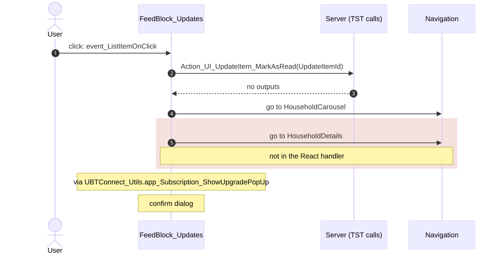

Mermaid source

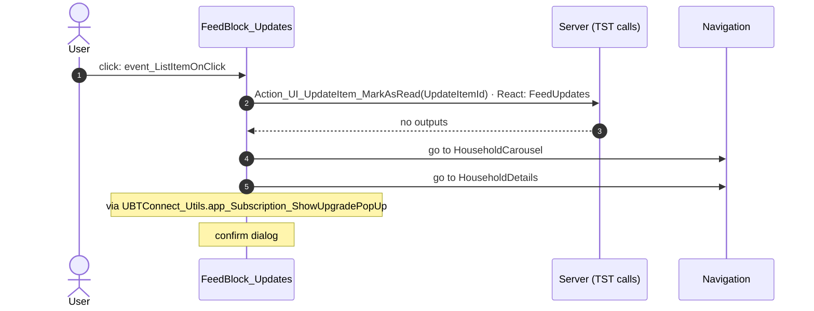
```mermaid
sequenceDiagram
  autonumber
  actor U as User
  participant B as FeedBlock_Updates
  participant S as Server (TST calls)
  participant N as Navigation
  U->>B: click: event_ListItemOnClick
  B->>S: Action_UI_UpdateItem_MarkAsRead(UpdateItemId) · React: FeedUpdates
  S-->>B: no outputs
  B->>N: go to HouseholdCarousel
  B->>N: go to HouseholdDetails
  Note over B: via UBTConnect_Utils.app_Subscription_ShowUpgradePopUp
  Note over B: confirm dialog
```

### 5.6 FeedBlock_CommunityPopulation: click onClick_Block

Mermaid source

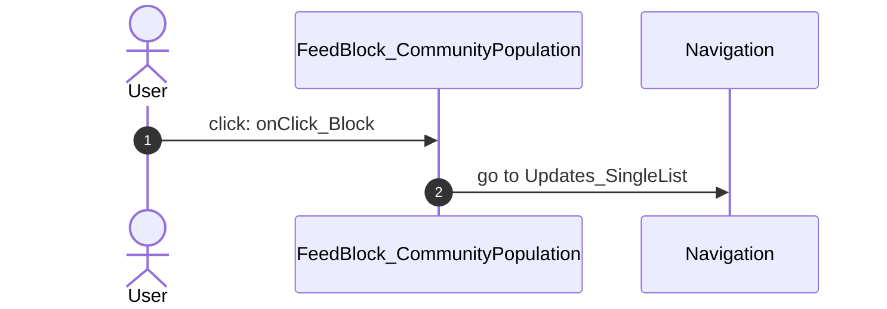
```mermaid
sequenceDiagram
  autonumber
  actor U as User
  participant B as FeedBlock_CommunityPopulation
  participant N as Navigation
  U->>B: click: onClick_Block
  B->>N: go to Updates_SingleList
```

### 5.7 FeedBlock_Updates: click event_MarkAsRead

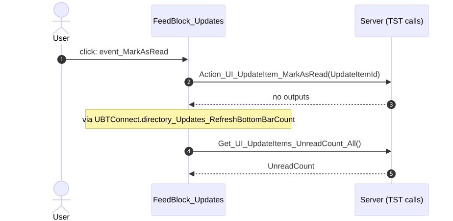

Mermaid source

```mermaid
sequenceDiagram
  autonumber
  actor U as User
  participant B as FeedBlock_Updates
  participant S as Server (TST calls)
  U->>B: click: event_MarkAsRead
  B->>S: Action_UI_UpdateItem_MarkAsRead(UpdateItemId) · React: FeedUpdates
  S-->>B: no outputs
  Note over B: via UBTConnect.directory_Updates_RefreshBottomBarCount
  B->>S: Get_UI_UpdateItems_UnreadCount_All() · React: BottomBar
  S-->>B: UnreadCount
```

### 5.8 FeedBlock_Updates: click event_MarkAsUnread

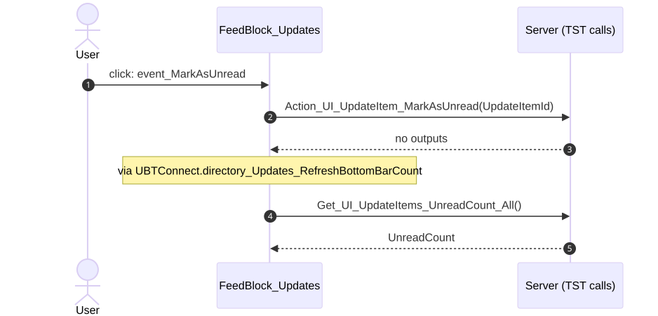

Mermaid source

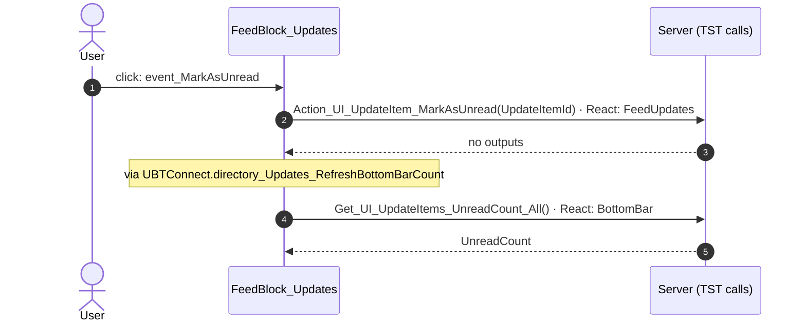
```mermaid
sequenceDiagram
  autonumber
  actor U as User
  participant B as FeedBlock_Updates
  participant S as Server (TST calls)
  U->>B: click: event_MarkAsUnread
  B->>S: Action_UI_UpdateItem_MarkAsUnread(UpdateItemId) · React: FeedUpdates
  S-->>B: no outputs
  Note over B: via UBTConnect.directory_Updates_RefreshBottomBarCount
  B->>S: Get_UI_UpdateItems_UnreadCount_All() · React: BottomBar
  S-->>B: UnreadCount
```

### 5.9 FeedBlock_Updates: click event_SendGift

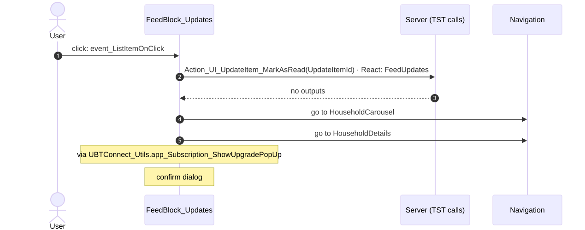

Mermaid source

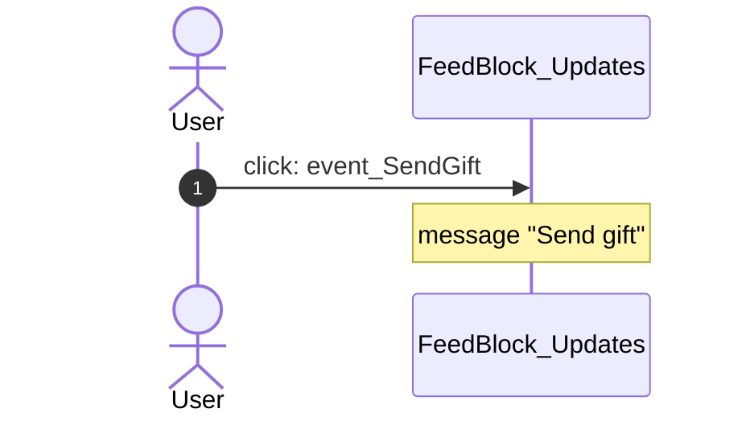
```mermaid
sequenceDiagram
  autonumber
  actor U as User
  participant B as FeedBlock_Updates
  U->>B: click: event_SendGift
  Note over B: message "Send gift"
```

### 5.10 FeedBlock_Services: click onClick_ServiceSettings

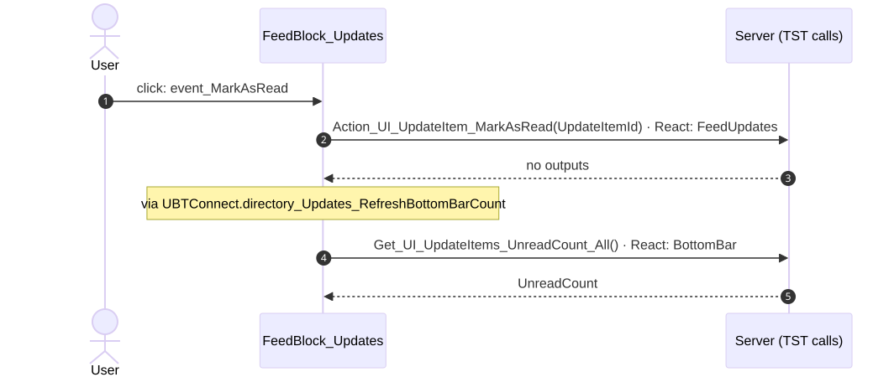

Mermaid source

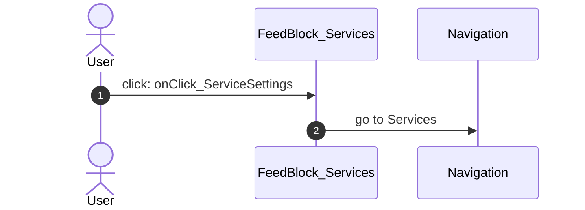
```mermaid
sequenceDiagram
  autonumber
  actor U as User
  participant B as FeedBlock_Services
  participant N as Navigation
  U->>B: click: onClick_ServiceSettings
  B->>N: go to Services
```

### 5.11 FeedBlock_Services: click onClick_Service (orbit)

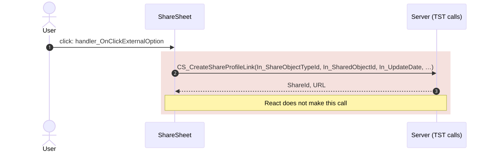

Mermaid source

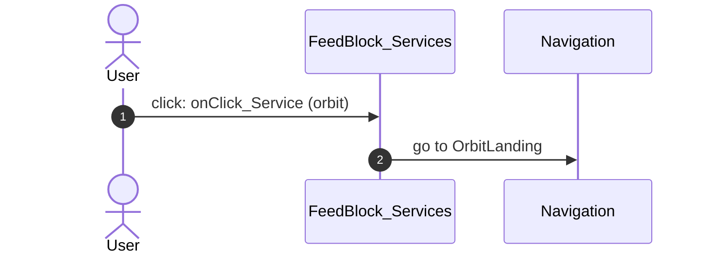
```mermaid
sequenceDiagram
  autonumber
  actor U as User
  participant B as FeedBlock_Services
  participant N as Navigation
  U->>B: click: onClick_Service (orbit)
  B->>N: go to OrbitLanding
```

### 5.12 FeedBlock_Services: click onClick_Service (lDM)

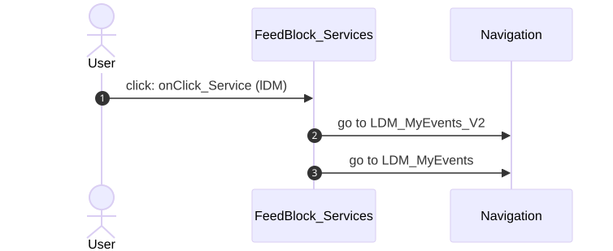

Mermaid source

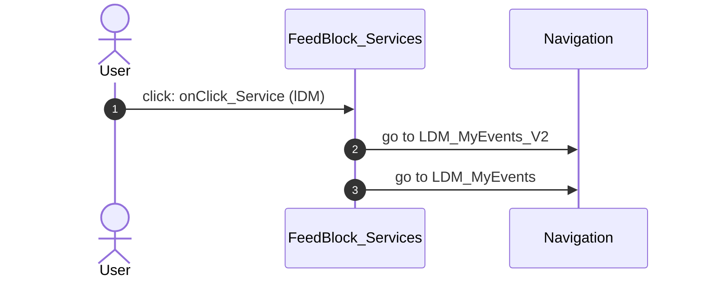
```mermaid
sequenceDiagram
  autonumber
  actor U as User
  participant B as FeedBlock_Services
  participant N as Navigation
  U->>B: click: onClick_Service (lDM)
  B->>N: go to LDM_MyEvents_V2
  B->>N: go to LDM_MyEvents
```

### 5.13 FeedBlock_Services: click onClick_Service (myCalendar)

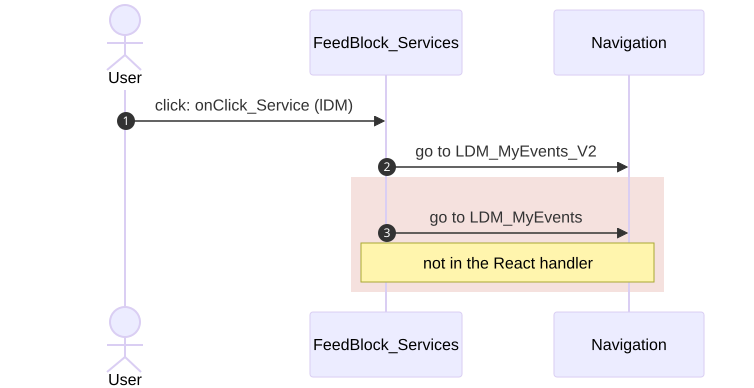

Mermaid source

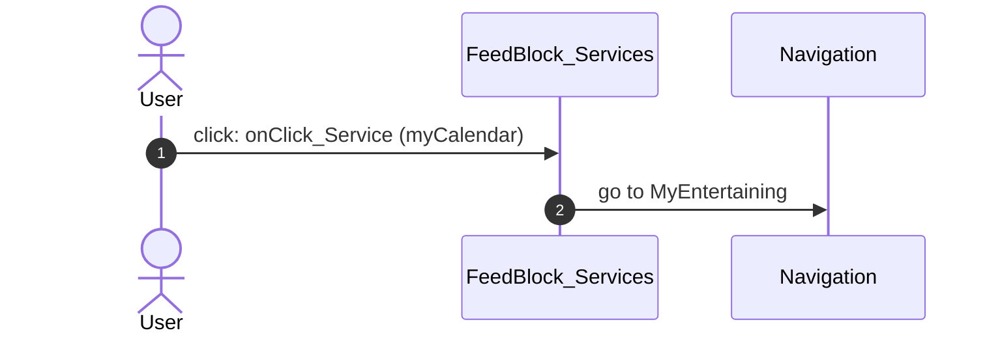
```mermaid
sequenceDiagram
  autonumber
  actor U as User
  participant B as FeedBlock_Services
  participant N as Navigation
  U->>B: click: onClick_Service (myCalendar)
  B->>N: go to MyEntertaining
```

### 5.14 FeedBlock_Services: click onClick_Service (assemble)

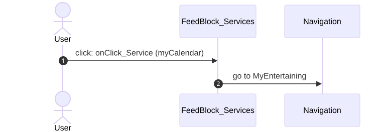

Mermaid source

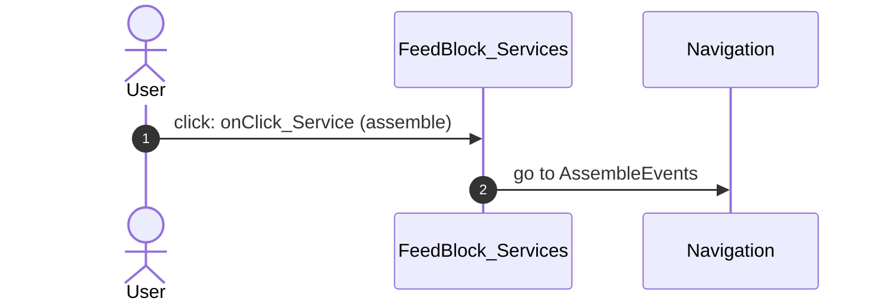
```mermaid
sequenceDiagram
  autonumber
  actor U as User
  participant B as FeedBlock_Services
  participant N as Navigation
  U->>B: click: onClick_Service (assemble)
  B->>N: go to AssembleEvents
```

### 5.15 FeedBlock_Services: click onClick_Service (orbitAdmin)

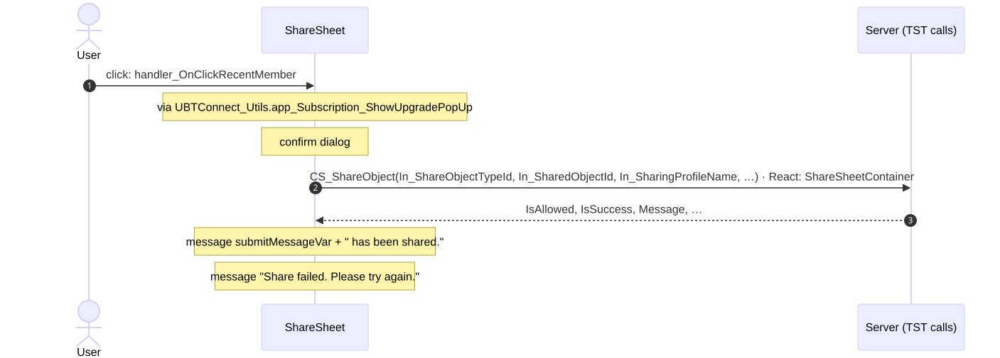

Mermaid source

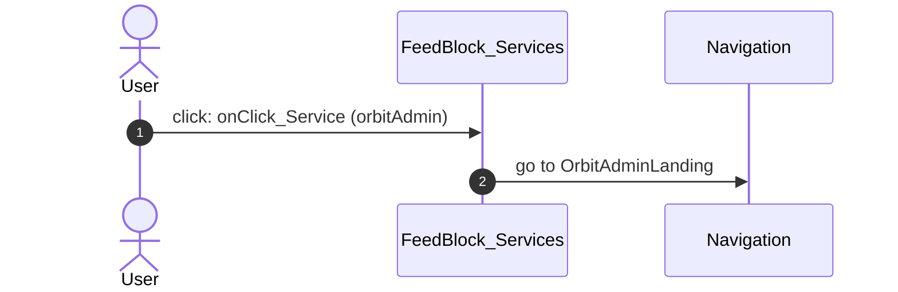
```mermaid
sequenceDiagram
  autonumber
  actor U as User
  participant B as FeedBlock_Services
  participant N as Navigation
  U->>B: click: onClick_Service (orbitAdmin)
  B->>N: go to OrbitAdminLanding
```

### 5.16 FeedBlock_Services: click onClick_Service (myNotes)

Mermaid source

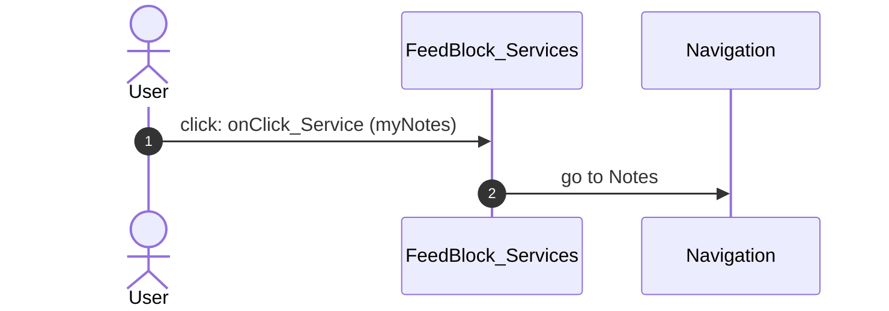
```mermaid
sequenceDiagram
  autonumber
  actor U as User
  participant B as FeedBlock_Services
  participant N as Navigation
  U->>B: click: onClick_Service (myNotes)
  B->>N: go to Notes
```

### 5.17 FeedBlock_Services: click onClick_Service (other)

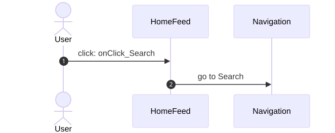

Mermaid source

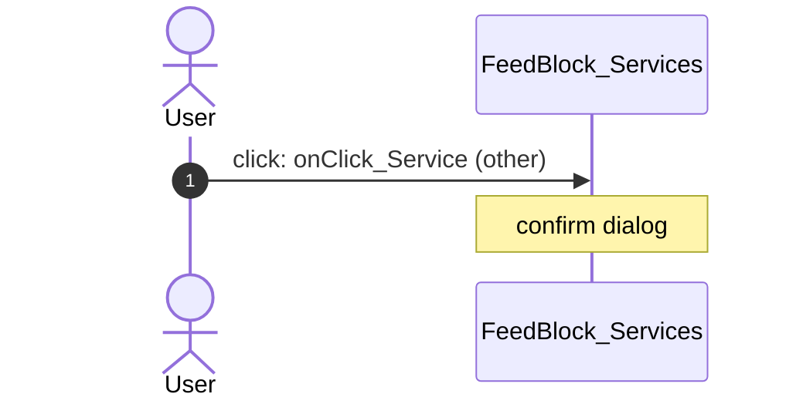
```mermaid
sequenceDiagram
  autonumber
  actor U as User
  participant B as FeedBlock_Services
  U->>B: click: onClick_Service (other)
  Note over B: confirm dialog
```

### 5.18 ShareSheet: click handler_OnClickExternalOption

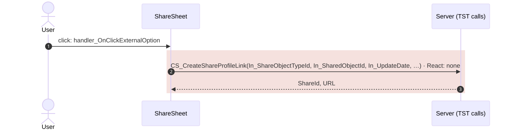

Mermaid source

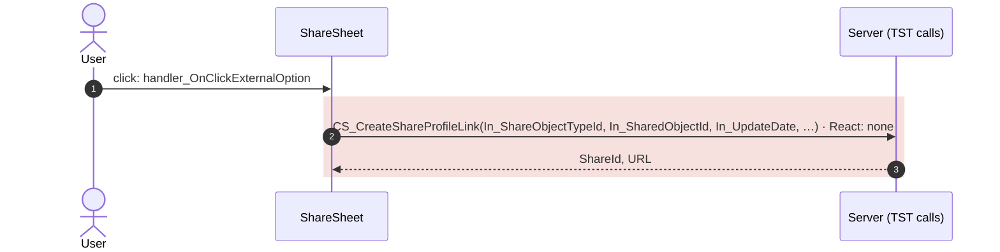
```mermaid
sequenceDiagram
  autonumber
  actor U as User
  participant B as ShareSheet
  participant S as Server (TST calls)
  U->>B: click: handler_OnClickExternalOption
  rect rgba(192, 57, 43, 0.15)
  B->>S: CS_CreateShareProfileLink(In_ShareObjectTypeId, In_SharedObjectId, In_UpdateDate, …) · React: none
  S-->>B: ShareId, URL
  end
```

### 5.19 ShareSheet: click handler_OnClickRecentMember

Mermaid source

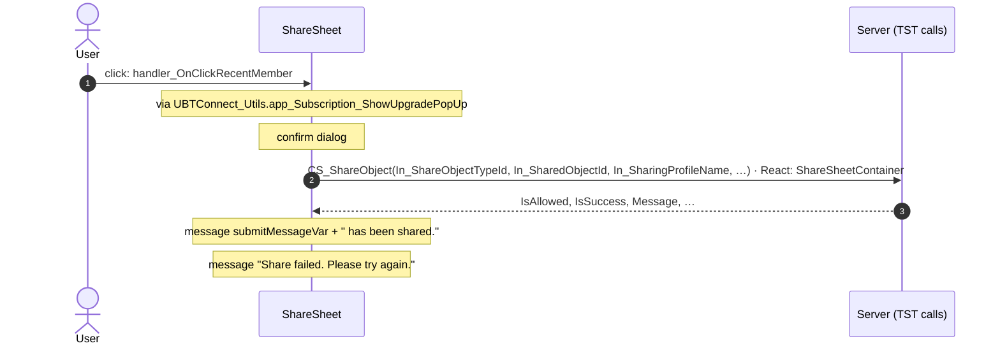
```mermaid
sequenceDiagram
  autonumber
  actor U as User
  participant B as ShareSheet
  participant S as Server (TST calls)
  U->>B: click: handler_OnClickRecentMember
  Note over B: via UBTConnect_Utils.app_Subscription_ShowUpgradePopUp
  Note over B: confirm dialog
  B->>S: CS_ShareObject(In_ShareObjectTypeId, In_SharedObjectId, In_SharingProfileName, …) · React: ShareSheetContainer
  S-->>B: IsAllowed, IsSuccess, Message, …
  Note over B: message submitMessageVar + " has been shared."
  Note over B: message "Share failed. Please try again."
```

### 5.20 HomeFeed: click onClick_Search

Mermaid source

```mermaid
sequenceDiagram
  autonumber
  actor U as User
  participant B as HomeFeed
  participant N as Navigation
  U->>B: click: onClick_Search
  B->>N: go to Search
```

### 5.21 HomeFeed: click section_UpdatesOnClick_ViewAll

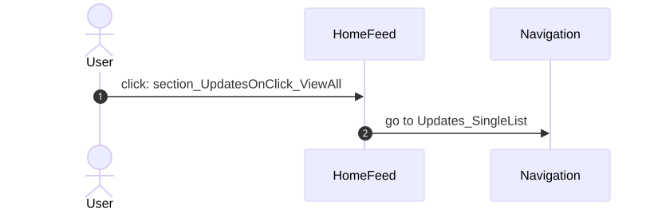

Mermaid source

```mermaid
sequenceDiagram
  autonumber
  actor U as User
  participant B as HomeFeed
  participant N as Navigation
  U->>B: click: section_UpdatesOnClick_ViewAll
  B->>N: go to Updates_SingleList
```

### 5.22 ShareSheet: submit handler_InputEventSubmit

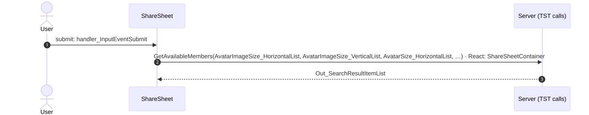

Mermaid source

```mermaid
sequenceDiagram
  autonumber
  actor U as User
  participant B as ShareSheet
  participant S as Server (TST calls)
  U->>B: submit: handler_InputEventSubmit
  B->>S: GetAvailableMembers(AvatarImageSize_HorizontalList, AvatarImageSize_VerticalList, AvatarSize_HorizontalList, …) · React: ShareSheetContainer
  S-->>B: Out_SearchResultItemList
```

### 5.23 ShareSheet: click handler_OnClickSend

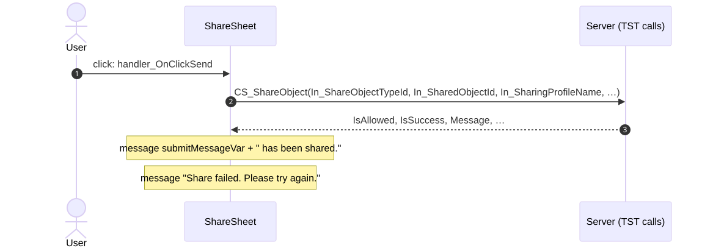

Mermaid source

```mermaid
sequenceDiagram
  autonumber
  actor U as User
  participant B as ShareSheet
  participant S as Server (TST calls)
  U->>B: click: handler_OnClickSend
  B->>S: CS_ShareObject(In_ShareObjectTypeId, In_SharedObjectId, In_SharingProfileName, …) · React: ShareSheetContainer
  S-->>B: IsAllowed, IsSuccess, Message, …
  Note over B: message submitMessageVar + " has been shared."
  Note over B: message "Share failed. Please try again."
```

## 6. Server calls

- **Called from (OutSystems):** the block or the app-level module whose own client action makes the call.
- **Made by (TST):** for each block in "Called from", its chain of client actions from the block to the call.
- **Trigger:** when the call runs, from the start of the chain on TST.
- **Seen on TST:** `yes` when TST made the call in the capture. Many calls run only after a click.
- **React action:** the React function that makes the same call, and the part that loads it: `shell`, `page` or both.
- **React caller:** the nearest React component that uses the React action, and the hooks between them. At most 2 chains, the shortest first.

| # | Call (TST) | Kind | Called from (OutSystems) | Trigger | Made by (TST) | Seen on TST | React action | React caller | Status |
|---|---|---|---|---|---|---|---|---|---|
| 1 | `UBTConnect_EmbedFeed/Blocks/Embedded_FeedCMS/DataActionGetFeedConfig` | data action | `Embedded_FeedCMS` | block load (fetch at start) | Embedded_FeedCMS fetch at start → Embedded_FeedCMS.DataActionGetFeedConfig | yes | `fetchFeedConfig()` [`api/feed/repository.ts:9`](../../app/src/api/feed/repository.ts#L9) (page) | `HomeFeed → useEmbeddedFeed → useFeedConfigQuery → fetchFeedConfig` [`pages/HomeFeed/HomeFeedPage.tsx`](../../app/src/pages/HomeFeed/HomeFeedPage.tsx) | implemented |
| 2 | `UBTConnect/Home/FeedBlock_CommunityPopulation/DataActionFetchCount` | data action | `FeedBlock_CommunityPopulation` | block load (fetch at start) | FeedBlock_CommunityPopulation fetch at start → FeedBlock_CommunityPopulation.DataActionFetchCount | yes | `fetchCommunityPopulation()` [`api/member/repository.ts:25`](../../app/src/api/member/repository.ts#L25) (page) | `HomeFeed → useCommunityPopulationQuery → fetchCommunityPopulation` [`pages/HomeFeed/HomeFeedPage.tsx`](../../app/src/pages/HomeFeed/HomeFeedPage.tsx) | implemented |
| 3 | `UBTConnect/Home/FeedBlock_Services/DataActionGetServices` | data action | `FeedBlock_Services` | block load (fetch at start) | FeedBlock_Services fetch at start → FeedBlock_Services.DataActionGetServices | yes | `fetchFeedServices()` [`api/service/repository.ts:34`](../../app/src/api/service/repository.ts#L34) (page) | `FeedServices → useFeedServices → useFeedServicesQuery → fetchFeedServices` [`pages/HomeFeed/HomeFeedPage.tsx`](../../app/src/pages/HomeFeed/HomeFeedPage.tsx) | implemented |
| 4 | `UBTConnect/Home/FeedBlock_Updates/DataActionFetchUpdates` | data action | `FeedBlock_Updates` | block load (fetch at start) | FeedBlock_Updates fetch at start → FeedBlock_Updates.DataActionFetchUpdates | yes | `fetchFeedUpdates()` [`api/update/repository.ts:22`](../../app/src/api/update/repository.ts#L22) (page) | `FeedUpdates → useFeedUpdates → useFeedUpdatesQuery → fetchFeedUpdates` [`pages/HomeFeed/HomeFeedPage.tsx`](../../app/src/pages/HomeFeed/HomeFeedPage.tsx) | implemented |
| 5 | `UBTConnect/Home/FeedBlock_Updates/ServiceAPIAction_UI_UpdateItem_MarkAsRead` | service action | `FeedBlock_Updates` | click | FeedBlock_Updates.event_ListItemOnClick → server Action_UI_UpdateItem_MarkAsRead (+1 more chains) | no | `markUpdateItemAsRead()` [`api/update/repository.ts:47`](../../app/src/api/update/repository.ts#L47) (page) | `FeedUpdates → useFeedUpdates → markUpdateItemAsRead` [`pages/HomeFeed/HomeFeedPage.tsx`](../../app/src/pages/HomeFeed/HomeFeedPage.tsx) | implemented |
| 6 | `UBTConnect/Home/FeedBlock_Updates/ServiceAPIAction_UI_UpdateItem_MarkAsUnread` | service action | `FeedBlock_Updates` | click | FeedBlock_Updates.event_MarkAsUnread → server Action_UI_UpdateItem_MarkAsUnread | no | `markUpdateItemAsUnread()` [`api/update/repository.ts:52`](../../app/src/api/update/repository.ts#L52) (page) | `FeedUpdates → useFeedUpdates → markUpdateItemAsUnread` [`pages/HomeFeed/HomeFeedPage.tsx`](../../app/src/pages/HomeFeed/HomeFeedPage.tsx) | implemented |
| 7 | `UBTConnect/ServiceAPIGet_UI_UpdateItems_UnreadCount_All` | service action | `FeedBlock_Updates` | click | FeedBlock_Updates.event_MarkAsRead → UBTConnect.directory_Updates_RefreshBottomBarCount → server Get_UI_UpdateItems_UnreadCount_All (+1 more chains) | no | `fetchUnreadUpdateItemsCount()` [`api/update/repository.ts:73`](../../app/src/api/update/repository.ts#L73) (page) | `BottomBar → directory_Updates_RefreshBottomBarCount → fetchUnreadUpdateItemsCount` [`components/layout/BottomBar/BottomBar.tsx`](../../app/src/components/layout/BottomBar/BottomBar.tsx) `FeedUpdates → useFeedUpdates → directory_Updates_RefreshBottomBarCount → fetchUnreadUpdateItemsCount` [`pages/HomeFeed/HomeFeedPage.tsx`](../../app/src/pages/HomeFeed/HomeFeedPage.tsx) | implemented |
| 8 | `Connect2_LegacyShared/ActionGetAllApplicationEvents` | server action | `Feed_Embeded` | click | Feed_Embeded.handle_Share_Others → UBTConnect_Utils.shareEntity_ByURL → … → server GetAllApplicationEvents | no | – | – | **missing** |
| 9 | `UBTConnect_Utils/ActionCS_CreateShareProfileLink` | server action | `Feed_Embeded` | click | Feed_Embeded.handle_Share_Others → UBTConnect_Utils.shareEntity_ByURL → server CS_CreateShareProfileLink | no | – | – | **missing** |
| 10 | `UBTConnect/Home/HomeFeed/DataActionGetCommunityStatistics` | data action | `HomeFeed` | ready | HomeFeed.OnReady → HomeFeed.screenEvent_OnReady → HomeFeed.DataActionGetCommunityStatistics (+1 more chains) | yes | `fetchHomeFeedCommunityStatistics()` [`api/country/repository.ts:49`](../../app/src/api/country/repository.ts#L49) (page) | `HomeFeed → useHomeFeedReady → fetchHomeFeedCommunityStatistics` [`pages/HomeFeed/HomeFeedPage.tsx`](../../app/src/pages/HomeFeed/HomeFeedPage.tsx) | implemented |
| 11 | `UBTConnect_Utils/CW_Share/ShareSheet/ActionCS_CreateShareProfileLink` | server action | `ShareSheet` | click | ShareSheet.handler_OnClickExternalOption → server CS_CreateShareProfileLink | no | – | – | **missing** |
| 12 | `UBTConnect_Utils/CW_Share/ShareSheet/ActionCS_ShareObject` | server action | `ShareSheet` | click | ShareSheet.handler_OnClickRecentMember → ShareSheet.action_SubmitShare → server CS_ShareObject (+1 more chains) | no | `csShareObject()` [`api/share/shareSheet.ts:25`](../../app/src/api/share/shareSheet.ts#L25) (page) | `ShareSheetContainer → useShareSheet → csShareObject` [`containers/ShareSheet/ShareSheetContainer.tsx`](../../app/src/containers/ShareSheet/ShareSheetContainer.tsx) | implemented |
| 13 | `UBTConnect_Utils/CW_Share/ShareSheet/DataActionGetAvailableMembers` | data action | `ShareSheet` | submit | ShareSheet.handler_InputEventSubmit → ShareSheet.DataActionGetAvailableMembers (+1 more chains) | no | `fetchAvailableMembers()` [`api/member/repository.ts:12`](../../app/src/api/member/repository.ts#L12) (page) | `ShareSheetContainer → useShareSheet → useAvailableMembersQuery → fetchAvailableMembers` [`containers/ShareSheet/ShareSheetContainer.tsx`](../../app/src/containers/ShareSheet/ShareSheetContainer.tsx) | implemented |
| 14 | `UBTConnect_Utils/CW_Share/ShareSheet/DataActionGetRecentlyShared` | data action | `ShareSheet` | parameters change | ShareSheet.OnParametersChanged → ShareSheet.screenEvent_OnParametersChanged → ShareSheet.DataActionGetRecentlyShared (+1 more chains) | no | `fetchRecentlyShared()` [`api/share/shareSheet.ts:14`](../../app/src/api/share/shareSheet.ts#L14) (page) | `ShareSheetContainer → useShareSheet → useRecentlySharedQuery → fetchRecentlyShared` [`containers/ShareSheet/ShareSheetContainer.tsx`](../../app/src/containers/ShareSheet/ShareSheetContainer.tsx) | implemented |

## 7. Missing in React

- Call `UBTConnect_Utils/CW_Share/ShareSheet/ActionCS_CreateShareProfileLink`. Chain on TST: onClick in CircleButton_WithLabel → CircleButton_WithLabel.action_OnClick → event onClick of CircleButton_WithLabel → ShareSheet.handler_OnClickExternalOption → server CS_CreateShareProfileLink.
  - React has the function, but this route does not use it: `csCreateShareProfileLink()` [`api/share/shareSheet.ts:39`](../../app/src/api/share/shareSheet.ts#L39).
  - Note in [`api/share/shareSheet.ts:35`](../../app/src/api/share/shareSheet.ts#L35): "/** CS_CreateShareProfileLink (Handler_OnClickExternalOption, ShareSheet.mvc.js:2250-2301): the share id and URL. */"
  - Note in [`components/feed/EmbeddedFeed/README.md:66`](../../app/src/components/feed/EmbeddedFeed/README.md#L66): "is not wired: ShareEntity_ByURL (UBTConnect_Utils) is not ported (SocialSharing plugin + CS_CreateShareProfileLink),"
  - Note in [`containers/ShareSheet/README.md:56`](../../app/src/containers/ShareSheet/README.md#L56): "- ActionCS_CreateShareProfileLink (`cs_CreateShareProfileLink`)."
- Call `UBTConnect_Utils/ActionCS_CreateShareProfileLink`. Chain on TST: event event_Clicked of ContactPopup → SharePopup.onClick_CallButton → event event_ShareToOthers of SharePopup → Feed_Embeded.handle_Share_Others → UBTConnect_Utils.shareEntity_ByURL → server CS_CreateShareProfileLink.
  - No React code makes this call.
  - Note in [`api/share/shareSheet.ts:35`](../../app/src/api/share/shareSheet.ts#L35): "/** CS_CreateShareProfileLink (Handler_OnClickExternalOption, ShareSheet.mvc.js:2250-2301): the share id and URL. */"
  - Note in [`components/feed/EmbeddedFeed/README.md:65`](../../app/src/components/feed/EmbeddedFeed/README.md#L65): "- Event_ShareToOthers → Handle_Share_Others (:257, :775-807: close, then ShareEntity_ByURL(Type_ShareObject.Feed, Id))"
  - Note in [`containers/EntityDetailsActions/README.md:74`](../../app/src/containers/EntityDetailsActions/README.md#L74): "- **Share to others**: the React app does not port UBTConnect_Utils ShareEntity_ByURL. The dialog only closes."
- Call `Connect2_LegacyShared/ActionGetAllApplicationEvents`. Chain on TST: SharePopup.onClick_CallButton → event event_ShareToOthers of SharePopup → Feed_Embeded.handle_Share_Others → UBTConnect_Utils.shareEntity_ByURL → Connect2_LegacyShared.auditShareEvent → Connect2_LegacyShared.zOnApplicationEvent_Wrapper → Connect2_LegacyShared.getAppEventName → Connect2_LegacyShared.cacheLocalApplicationEvents → server GetAllApplicationEvents.
  - No React code makes this call.

## 8. Questions

1. React calls `/api/UBTConnect_Utils/ActionGetSignedImagesInBulk` from `cache_SignedImageURL_GetCallback()` [`lib/ubtConnectUtils/actions.ts:124`](../../app/src/lib/ubtConnectUtils/actions.ts#L124) (page). TST HomeFeed has no chain to this call. Does the call belong to this route?
2. React calls `/api/UBTConnect_Utils/CacheControl_Policies/DataActionGetCacheInfo` from `fetchPolicies()` [`api/app/repository.ts:54`](../../app/src/api/app/repository.ts#L54) (shell + page). TST HomeFeed has no chain to this call. Does the call belong to this route?

## 9. Method

1. **OutSystems (TST).** The tool reads `facts.json` and the compiled code of `migration/screens/HomeFeed/analysis/`:
   - the rendered files;
   - each server call with its chain of client actions, and the calls that TST made in the capture;
   - the effects of each user action.
2. **Route and app shell.** The app shell has these parts:
   - `CommonUI_InsideLayout` with its blocks, and the app-level actions;
   - the business blocks that at least 40% of the captured routes render, for example the bottom bar.
   This file shows only the other blocks.
3. **MCP (DEV).** The tool reads the UI flow with `getScreenNames`. TST wins when DEV is different.
4. **React.** `react_calls.mjs` reads the app shell from `app/src/main.tsx` and the screen from its `<Route>Page.tsx`. It counts only the code that the app uses.
5. **Match.** `callAction(M, A)` gives `/api/M/A`. The `x-os-paths` of `app/src/api/openapi.yaml` give the TST call. The status is `implemented` when the TST call is the same. Else the status is `missing`.

Limit: a name or a call match does not prove the same behaviour. The parity checks of the migration compare the behaviour.
