# Sitemap: UBTConnect (TST)

Generated by `python3 migration/tools/sitemap.py` from the TST survey (compiled code). Do not edit by hand.
83 screens · 806 screen → screen links. 247 links belong to one screen; the 5 shared frame blocks give the other links (diagram 2).

**Colors:** solid border = decided on the board (dark green build, dark grey skip); dashed border = only a proposal in
`scope-review.md` (light green: build proposed, yellow: decision needed, light grey: skip proposed); white box = screen of another area.

In an area diagram: hexagon = block that 3 or more screens use (drawn once); dotted arrow = screen that contains this block.

To view: open `migration/sitemap.html` in a browser, or use VS Code with the extension *Markdown Preview Mermaid Support*.

## 1. Overview by area

Arrow = number of own links between two areas (links of the shared frame are not counted).

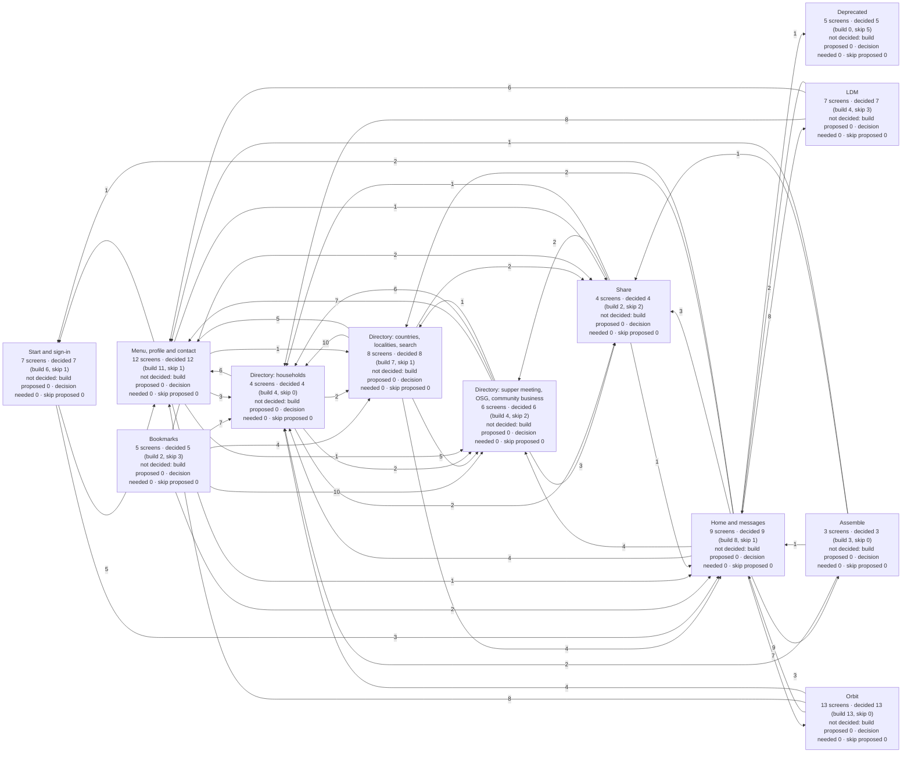
```mermaid
flowchart LR
  A0["Start and sign-in<br/>7 screens · decided 7 (build 6, skip 1)<br/>not decided: build proposed 0 · decision needed 0 · skip proposed 0"]
  A1["Home and messages<br/>9 screens · decided 9 (build 8, skip 1)<br/>not decided: build proposed 0 · decision needed 0 · skip proposed 0"]
  A2["Directory: countries, localities, search<br/>8 screens · decided 8 (build 7, skip 1)<br/>not decided: build proposed 0 · decision needed 0 · skip proposed 0"]
  A3["Directory: households<br/>4 screens · decided 4 (build 4, skip 0)<br/>not decided: build proposed 0 · decision needed 0 · skip proposed 0"]
  A4["Directory: supper meeting, OSG, community business<br/>6 screens · decided 6 (build 4, skip 2)<br/>not decided: build proposed 0 · decision needed 0 · skip proposed 0"]
  A5["Bookmarks<br/>5 screens · decided 5 (build 2, skip 3)<br/>not decided: build proposed 0 · decision needed 0 · skip proposed 0"]
  A6["Orbit<br/>13 screens · decided 13 (build 13, skip 0)<br/>not decided: build proposed 0 · decision needed 0 · skip proposed 0"]
  A7["LDM<br/>7 screens · decided 7 (build 4, skip 3)<br/>not decided: build proposed 0 · decision needed 0 · skip proposed 0"]
  A8["Assemble<br/>3 screens · decided 3 (build 3, skip 0)<br/>not decided: build proposed 0 · decision needed 0 · skip proposed 0"]
  A9["Menu, profile and contact<br/>12 screens · decided 12 (build 11, skip 1)<br/>not decided: build proposed 0 · decision needed 0 · skip proposed 0"]
  A10["Share<br/>4 screens · decided 4 (build 2, skip 2)<br/>not decided: build proposed 0 · decision needed 0 · skip proposed 0"]
  A11["Deprecated<br/>5 screens · decided 5 (build 0, skip 5)<br/>not decided: build proposed 0 · decision needed 0 · skip proposed 0"]
  A2 -->|10| A3
  A5 -->|10| A4
  A6 -->|9| A1
  A1 -->|8| A7
  A7 -->|8| A3
  A6 -->|8| A9
  A5 -->|7| A3
  A1 -->|7| A6
  A4 -->|7| A9
  A3 -->|6| A9
  A4 -->|6| A3
  A7 -->|6| A9
  A0 -->|5| A9
  A2 -->|5| A9
  A2 -->|5| A4
  A2 -->|4| A1
  A1 -->|4| A3
  A5 -->|4| A2
  A1 -->|4| A4
  A6 -->|4| A3
  A0 -->|3| A1
  A9 -->|3| A3
  A1 -->|3| A8
  A4 -->|3| A10
  A1 -->|3| A10
  A5 -->|2| A1
  A3 -->|2| A2
  A3 -->|2| A10
  A3 -->|2| A4
  A2 -->|2| A10
  A1 -->|2| A2
  A8 -->|2| A3
  A7 -->|2| A1
  A5 -->|2| A10
  A1 -->|2| A0
  A10 -->|2| A4
  A9 -->|1| A0
  A9 -->|1| A1
  A9 -->|1| A2
  A9 -->|1| A10
  A9 -->|1| A4
  A1 -->|1| A11
  A4 -->|1| A2
  A8 -->|1| A1
  A8 -->|1| A10
  A8 -->|1| A9
  A10 -->|1| A3
  A10 -->|1| A1
```

## 2. Shared frame and start flow

Most screens have these blocks in their layout. So every screen can go to the targets of these blocks.

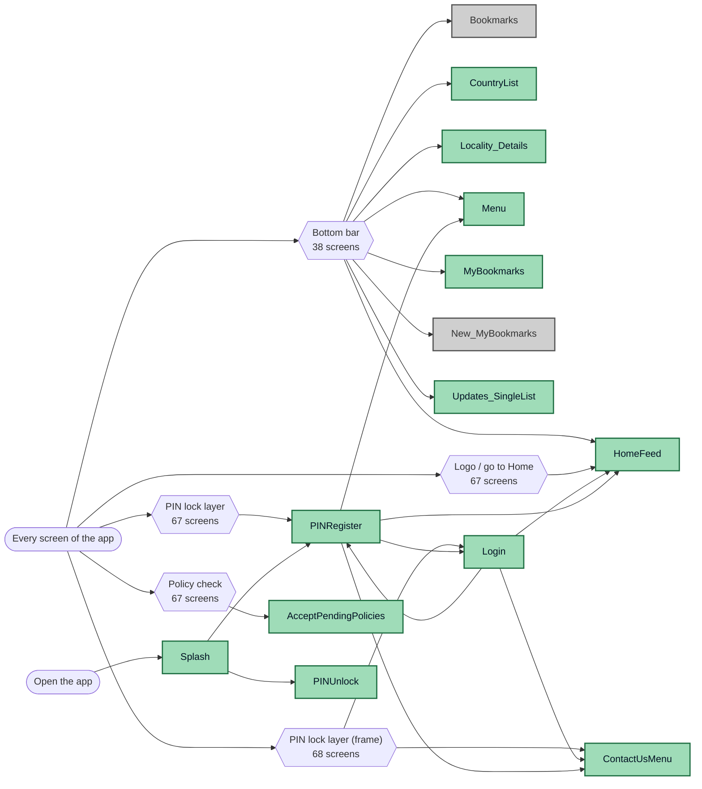
```mermaid
flowchart LR
  classDef build fill:#9fdcb8,stroke:#1f6f43,color:#012,stroke-width:2px
  classDef skip fill:#cfcfcf,stroke:#555555,color:#333,stroke-width:2px
  classDef pbuild fill:#e3f5ea,stroke:#2e8b57,color:#123,stroke-dasharray:4 3
  classDef decide fill:#fff1c9,stroke:#c99700,color:#321,stroke-dasharray:4 3
  classDef pskip fill:#f2f2f2,stroke:#999999,color:#666,stroke-dasharray:4 3
  classDef ext fill:#ffffff,stroke:#7a8ca3,color:#345,stroke-dasharray:2 2
  classDef hub fill:#e8eefc,stroke:#5b74b8,color:#223
  ANY(["Every screen of the app"])
  B0{{"Bottom bar<br/>38 screens"}}
  ANY --> B0
  Bookmarks["Bookmarks"]:::skip
  B0 --> Bookmarks
  CountryList["CountryList"]:::build
  B0 --> CountryList
  HomeFeed["HomeFeed"]:::build
  B0 --> HomeFeed
  Locality_Details["Locality_Details"]:::build
  B0 --> Locality_Details
  Menu["Menu"]:::build
  B0 --> Menu
  MyBookmarks["MyBookmarks"]:::build
  B0 --> MyBookmarks
  New_MyBookmarks["New_MyBookmarks"]:::skip
  B0 --> New_MyBookmarks
  Updates_SingleList["Updates_SingleList"]:::build
  B0 --> Updates_SingleList
  B1{{"Logo / go to Home<br/>67 screens"}}
  ANY --> B1
  B1 --> HomeFeed
  B2{{"PIN lock layer<br/>67 screens"}}
  ANY --> B2
  PINRegister["PINRegister"]:::build
  B2 --> PINRegister
  B3{{"PIN lock layer (frame)<br/>68 screens"}}
  ANY --> B3
  ContactUsMenu["ContactUsMenu"]:::build
  B3 --> ContactUsMenu
  Login["Login"]:::build
  B3 --> Login
  B4{{"Policy check<br/>67 screens"}}
  ANY --> B4
  AcceptPendingPolicies["AcceptPendingPolicies"]:::build
  B4 --> AcceptPendingPolicies
  Splash["Splash"]:::build
  Splash --> PINRegister
  PINUnlock["PINUnlock"]:::build
  Splash --> PINUnlock
  Login --> ContactUsMenu
  Login --> HomeFeed
  Login --> PINRegister
  PINRegister --> ContactUsMenu
  PINRegister --> HomeFeed
  PINRegister --> Login
  PINRegister --> Menu
  START(["Open the app"]) --> Splash
```

## 3. Start and sign-in

Opened from other areas: Home and messages (2), Menu, profile and contact (1).

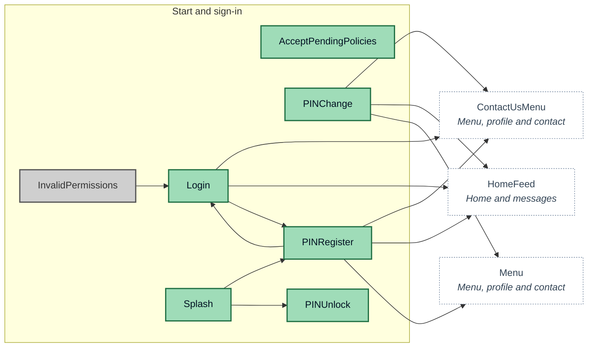
```mermaid
flowchart LR
  classDef build fill:#9fdcb8,stroke:#1f6f43,color:#012,stroke-width:2px
  classDef skip fill:#cfcfcf,stroke:#555555,color:#333,stroke-width:2px
  classDef pbuild fill:#e3f5ea,stroke:#2e8b57,color:#123,stroke-dasharray:4 3
  classDef decide fill:#fff1c9,stroke:#c99700,color:#321,stroke-dasharray:4 3
  classDef pskip fill:#f2f2f2,stroke:#999999,color:#666,stroke-dasharray:4 3
  classDef ext fill:#ffffff,stroke:#7a8ca3,color:#345,stroke-dasharray:2 2
  classDef hub fill:#e8eefc,stroke:#5b74b8,color:#223
  subgraph AREA["Start and sign-in"]
    AcceptPendingPolicies["AcceptPendingPolicies"]:::build
    InvalidPermissions["InvalidPermissions"]:::skip
    Login["Login"]:::build
    PINChange["PINChange"]:::build
    PINRegister["PINRegister"]:::build
    PINUnlock["PINUnlock"]:::build
    Splash["Splash"]:::build
  end
  ContactUsMenu["ContactUsMenu<br/><i>Menu, profile and contact</i>"]:::ext
  HomeFeed["HomeFeed<br/><i>Home and messages</i>"]:::ext
  Menu["Menu<br/><i>Menu, profile and contact</i>"]:::ext
  InvalidPermissions --> Login
  Login --> ContactUsMenu
  Login --> HomeFeed
  Login --> PINRegister
  PINChange --> ContactUsMenu
  PINChange --> HomeFeed
  PINChange --> Menu
  PINRegister --> ContactUsMenu
  PINRegister --> HomeFeed
  PINRegister --> Login
  PINRegister --> Menu
  Splash --> PINRegister
  Splash --> PINUnlock
```

## 4. Home and messages

Opened from other areas: Orbit (9), Directory: countries, localities, search (4), Start and sign-in (3), Bookmarks (2), LDM (2), Menu, profile and contact (1), Assemble (1), Share (1).

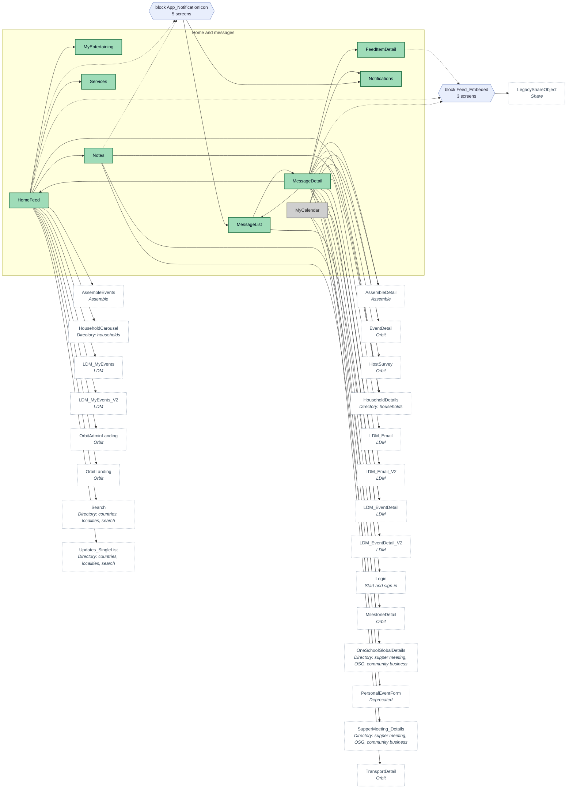
```mermaid
flowchart LR
  classDef build fill:#9fdcb8,stroke:#1f6f43,color:#012,stroke-width:2px
  classDef skip fill:#cfcfcf,stroke:#555555,color:#333,stroke-width:2px
  classDef pbuild fill:#e3f5ea,stroke:#2e8b57,color:#123,stroke-dasharray:4 3
  classDef decide fill:#fff1c9,stroke:#c99700,color:#321,stroke-dasharray:4 3
  classDef pskip fill:#f2f2f2,stroke:#999999,color:#666,stroke-dasharray:4 3
  classDef ext fill:#ffffff,stroke:#7a8ca3,color:#345,stroke-dasharray:2 2
  classDef hub fill:#e8eefc,stroke:#5b74b8,color:#223
  subgraph AREA["Home and messages"]
    FeedItemDetail["FeedItemDetail"]:::build
    HomeFeed["HomeFeed"]:::build
    MessageDetail["MessageDetail"]:::build
    MessageList["MessageList"]:::build
    MyCalendar["MyCalendar"]:::skip
    MyEntertaining["MyEntertaining"]:::build
    Notes["Notes"]:::build
    Notifications["Notifications"]:::build
    Services["Services"]:::build
  end
  AssembleDetail["AssembleDetail<br/><i>Assemble</i>"]:::ext
  AssembleEvents["AssembleEvents<br/><i>Assemble</i>"]:::ext
  EventDetail["EventDetail<br/><i>Orbit</i>"]:::ext
  HostSurvey["HostSurvey<br/><i>Orbit</i>"]:::ext
  HouseholdCarousel["HouseholdCarousel<br/><i>Directory: households</i>"]:::ext
  HouseholdDetails["HouseholdDetails<br/><i>Directory: households</i>"]:::ext
  LDM_Email["LDM_Email<br/><i>LDM</i>"]:::ext
  LDM_Email_V2["LDM_Email_V2<br/><i>LDM</i>"]:::ext
  LDM_EventDetail["LDM_EventDetail<br/><i>LDM</i>"]:::ext
  LDM_EventDetail_V2["LDM_EventDetail_V2<br/><i>LDM</i>"]:::ext
  LDM_MyEvents["LDM_MyEvents<br/><i>LDM</i>"]:::ext
  LDM_MyEvents_V2["LDM_MyEvents_V2<br/><i>LDM</i>"]:::ext
  LegacyShareObject["LegacyShareObject<br/><i>Share</i>"]:::ext
  Login["Login<br/><i>Start and sign-in</i>"]:::ext
  MilestoneDetail["MilestoneDetail<br/><i>Orbit</i>"]:::ext
  OneSchoolGlobalDetails["OneSchoolGlobalDetails<br/><i>Directory: supper meeting, OSG, community business</i>"]:::ext
  OrbitAdminLanding["OrbitAdminLanding<br/><i>Orbit</i>"]:::ext
  OrbitLanding["OrbitLanding<br/><i>Orbit</i>"]:::ext
  PersonalEventForm["PersonalEventForm<br/><i>Deprecated</i>"]:::ext
  Search["Search<br/><i>Directory: countries, localities, search</i>"]:::ext
  SupperMeeting_Details["SupperMeeting_Details<br/><i>Directory: supper meeting, OSG, community business</i>"]:::ext
  TransportDetail["TransportDetail<br/><i>Orbit</i>"]:::ext
  Updates_SingleList["Updates_SingleList<br/><i>Directory: countries, localities, search</i>"]:::ext
  H0{{"block App_NotificationIcon<br/>5 screens"}}:::hub
  H1{{"block Feed_Embeded<br/>3 screens"}}:::hub
  FeedItemDetail -.-> H1
  HomeFeed --> AssembleEvents
  HomeFeed --> HouseholdCarousel
  HomeFeed --> HouseholdDetails
  HomeFeed --> LDM_MyEvents
  HomeFeed --> LDM_MyEvents_V2
  HomeFeed --> MyEntertaining
  HomeFeed --> Notes
  HomeFeed --> OrbitAdminLanding
  HomeFeed --> OrbitLanding
  HomeFeed --> Search
  HomeFeed --> Services
  HomeFeed --> Updates_SingleList
  HomeFeed -.-> H0
  HomeFeed -.-> H1
  MessageDetail --> AssembleDetail
  MessageDetail --> EventDetail
  MessageDetail --> FeedItemDetail
  MessageDetail --> HomeFeed
  MessageDetail --> HostSurvey
  MessageDetail --> HouseholdDetails
  MessageDetail --> LDM_Email
  MessageDetail --> LDM_Email_V2
  MessageDetail --> LDM_EventDetail
  MessageDetail --> LDM_EventDetail_V2
  MessageDetail --> Login
  MessageDetail --> MessageList
  MessageDetail --> MilestoneDetail
  MessageDetail --> Notifications
  MessageDetail --> OneSchoolGlobalDetails
  MessageDetail --> SupperMeeting_Details
  MessageDetail -.-> H1
  MessageList --> Login
  MessageList --> MessageDetail
  MyCalendar --> AssembleDetail
  MyCalendar --> EventDetail
  MyCalendar --> LDM_EventDetail
  MyCalendar --> LDM_EventDetail_V2
  MyCalendar --> PersonalEventForm
  MyCalendar --> TransportDetail
  Notes --> HouseholdDetails
  Notes --> OneSchoolGlobalDetails
  Notes --> SupperMeeting_Details
  Notes -.-> H0
  H0 --> MessageList
  H0 --> Notifications
  H1 --> LegacyShareObject
```

## 5. Directory: countries, localities, search

Opened from other areas: Bookmarks (4), Directory: households (2), Home and messages (2), Menu, profile and contact (1), Directory: supper meeting, OSG, community business (1).

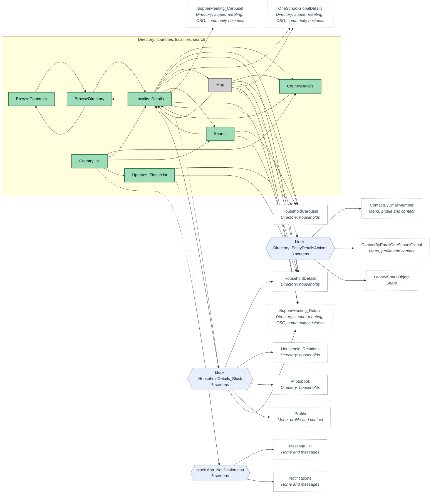
```mermaid
flowchart LR
  classDef build fill:#9fdcb8,stroke:#1f6f43,color:#012,stroke-width:2px
  classDef skip fill:#cfcfcf,stroke:#555555,color:#333,stroke-width:2px
  classDef pbuild fill:#e3f5ea,stroke:#2e8b57,color:#123,stroke-dasharray:4 3
  classDef decide fill:#fff1c9,stroke:#c99700,color:#321,stroke-dasharray:4 3
  classDef pskip fill:#f2f2f2,stroke:#999999,color:#666,stroke-dasharray:4 3
  classDef ext fill:#ffffff,stroke:#7a8ca3,color:#345,stroke-dasharray:2 2
  classDef hub fill:#e8eefc,stroke:#5b74b8,color:#223
  subgraph AREA["Directory: countries, localities, search"]
    BrowseCountries["BrowseCountries"]:::build
    BrowseDirectory["BrowseDirectory"]:::build
    CountryDetails["CountryDetails"]:::build
    CountryList["CountryList"]:::build
    Locality_Details["Locality_Details"]:::build
    Map["Map"]:::skip
    Search["Search"]:::build
    Updates_SingleList["Updates_SingleList"]:::build
  end
  ContactByEmailMember["ContactByEmailMember<br/><i>Menu, profile and contact</i>"]:::ext
  ContactByEmailOneSchoolGlobal["ContactByEmailOneSchoolGlobal<br/><i>Menu, profile and contact</i>"]:::ext
  HouseholdCarousel["HouseholdCarousel<br/><i>Directory: households</i>"]:::ext
  HouseholdDetails["HouseholdDetails<br/><i>Directory: households</i>"]:::ext
  Household_Relations["Household_Relations<br/><i>Directory: households</i>"]:::ext
  LegacyShareObject["LegacyShareObject<br/><i>Share</i>"]:::ext
  MessageList["MessageList<br/><i>Home and messages</i>"]:::ext
  Notifications["Notifications<br/><i>Home and messages</i>"]:::ext
  OneSchoolGlobalDetails["OneSchoolGlobalDetails<br/><i>Directory: supper meeting, OSG, community business</i>"]:::ext
  Photobook["Photobook<br/><i>Directory: households</i>"]:::ext
  Profile["Profile<br/><i>Menu, profile and contact</i>"]:::ext
  SupperMeeting_Carousel["SupperMeeting_Carousel<br/><i>Directory: supper meeting, OSG, community business</i>"]:::ext
  SupperMeeting_Details["SupperMeeting_Details<br/><i>Directory: supper meeting, OSG, community business</i>"]:::ext
  H0{{"block App_NotificationIcon<br/>5 screens"}}:::hub
  H1{{"block Directory_EntityDetailsActions<br/>8 screens"}}:::hub
  H2{{"block HouseholdDetails_Block<br/>5 screens"}}:::hub
  BrowseCountries --> BrowseDirectory
  BrowseDirectory --> BrowseCountries
  BrowseDirectory --> Locality_Details
  CountryDetails --> Locality_Details
  CountryList --> CountryDetails
  CountryList --> Locality_Details
  CountryList --> Search
  CountryList --> Updates_SingleList
  CountryList -.-> H0
  Locality_Details --> BrowseDirectory
  Locality_Details --> CountryDetails
  Locality_Details --> HouseholdCarousel
  Locality_Details --> HouseholdDetails
  Locality_Details --> Map
  Locality_Details --> OneSchoolGlobalDetails
  Locality_Details --> Search
  Locality_Details --> SupperMeeting_Carousel
  Locality_Details --> SupperMeeting_Details
  Locality_Details -.-> H1
  Locality_Details -.-> H2
  Map --> CountryDetails
  Map --> HouseholdCarousel
  Map --> HouseholdDetails
  Map --> Locality_Details
  Map --> OneSchoolGlobalDetails
  Map --> SupperMeeting_Details
  Map -.-> H1
  Search --> HouseholdCarousel
  Search --> HouseholdDetails
  Search --> Locality_Details
  Updates_SingleList --> HouseholdCarousel
  Updates_SingleList --> HouseholdDetails
  Updates_SingleList -.-> H0
  H0 --> MessageList
  H0 --> Notifications
  H1 --> ContactByEmailMember
  H1 --> ContactByEmailOneSchoolGlobal
  H1 --> LegacyShareObject
  H2 --> HouseholdDetails
  H2 --> Household_Relations
  H2 --> Locality_Details
  H2 --> Photobook
  H2 --> Profile
  H2 --> SupperMeeting_Details
```

## 6. Directory: households

Opened from other areas: Directory: countries, localities, search (10), LDM (8), Bookmarks (7), Directory: supper meeting, OSG, community business (6), Home and messages (4), Orbit (4), Menu, profile and contact (3), Assemble (2), Share (1).

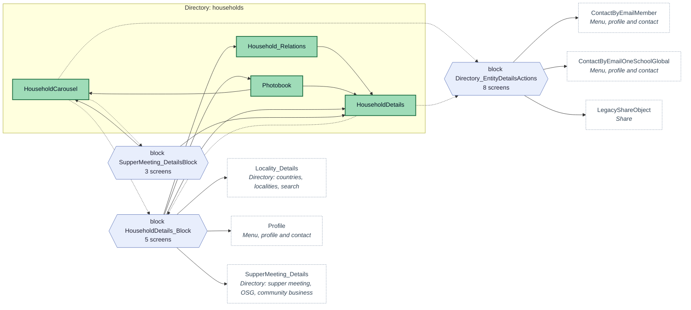
```mermaid
flowchart LR
  classDef build fill:#9fdcb8,stroke:#1f6f43,color:#012,stroke-width:2px
  classDef skip fill:#cfcfcf,stroke:#555555,color:#333,stroke-width:2px
  classDef pbuild fill:#e3f5ea,stroke:#2e8b57,color:#123,stroke-dasharray:4 3
  classDef decide fill:#fff1c9,stroke:#c99700,color:#321,stroke-dasharray:4 3
  classDef pskip fill:#f2f2f2,stroke:#999999,color:#666,stroke-dasharray:4 3
  classDef ext fill:#ffffff,stroke:#7a8ca3,color:#345,stroke-dasharray:2 2
  classDef hub fill:#e8eefc,stroke:#5b74b8,color:#223
  subgraph AREA["Directory: households"]
    HouseholdCarousel["HouseholdCarousel"]:::build
    HouseholdDetails["HouseholdDetails"]:::build
    Household_Relations["Household_Relations"]:::build
    Photobook["Photobook"]:::build
  end
  ContactByEmailMember["ContactByEmailMember<br/><i>Menu, profile and contact</i>"]:::ext
  ContactByEmailOneSchoolGlobal["ContactByEmailOneSchoolGlobal<br/><i>Menu, profile and contact</i>"]:::ext
  LegacyShareObject["LegacyShareObject<br/><i>Share</i>"]:::ext
  Locality_Details["Locality_Details<br/><i>Directory: countries, localities, search</i>"]:::ext
  Profile["Profile<br/><i>Menu, profile and contact</i>"]:::ext
  SupperMeeting_Details["SupperMeeting_Details<br/><i>Directory: supper meeting, OSG, community business</i>"]:::ext
  H0{{"block Directory_EntityDetailsActions<br/>8 screens"}}:::hub
  H1{{"block HouseholdDetails_Block<br/>5 screens"}}:::hub
  H2{{"block SupperMeeting_DetailsBlock<br/>3 screens"}}:::hub
  HouseholdCarousel -.-> H0
  HouseholdCarousel -.-> H1
  HouseholdCarousel -.-> H2
  HouseholdDetails -.-> H0
  HouseholdDetails -.-> H1
  Household_Relations --> HouseholdDetails
  Photobook --> HouseholdCarousel
  Photobook --> HouseholdDetails
  H0 --> ContactByEmailMember
  H0 --> ContactByEmailOneSchoolGlobal
  H0 --> LegacyShareObject
  H1 --> HouseholdDetails
  H1 --> Household_Relations
  H1 --> Locality_Details
  H1 --> Photobook
  H1 --> Profile
  H1 --> SupperMeeting_Details
  H2 --> HouseholdCarousel
  H2 --> HouseholdDetails
```

## 7. Directory: supper meeting, OSG, community business

Opened from other areas: Bookmarks (10), Directory: countries, localities, search (5), Home and messages (4), Directory: households (2), Share (2), Menu, profile and contact (1).

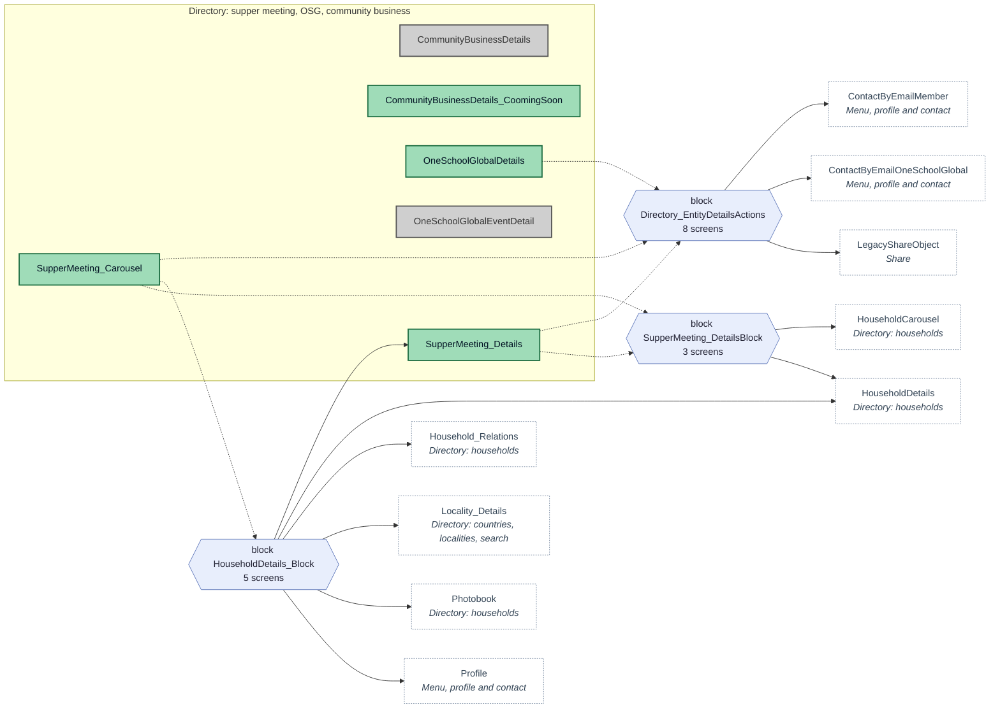
```mermaid
flowchart LR
  classDef build fill:#9fdcb8,stroke:#1f6f43,color:#012,stroke-width:2px
  classDef skip fill:#cfcfcf,stroke:#555555,color:#333,stroke-width:2px
  classDef pbuild fill:#e3f5ea,stroke:#2e8b57,color:#123,stroke-dasharray:4 3
  classDef decide fill:#fff1c9,stroke:#c99700,color:#321,stroke-dasharray:4 3
  classDef pskip fill:#f2f2f2,stroke:#999999,color:#666,stroke-dasharray:4 3
  classDef ext fill:#ffffff,stroke:#7a8ca3,color:#345,stroke-dasharray:2 2
  classDef hub fill:#e8eefc,stroke:#5b74b8,color:#223
  subgraph AREA["Directory: supper meeting, OSG, community business"]
    CommunityBusinessDetails["CommunityBusinessDetails"]:::skip
    CommunityBusinessDetails_CoomingSoon["CommunityBusinessDetails_CoomingSoon"]:::build
    OneSchoolGlobalDetails["OneSchoolGlobalDetails"]:::build
    OneSchoolGlobalEventDetail["OneSchoolGlobalEventDetail"]:::skip
    SupperMeeting_Carousel["SupperMeeting_Carousel"]:::build
    SupperMeeting_Details["SupperMeeting_Details"]:::build
  end
  ContactByEmailMember["ContactByEmailMember<br/><i>Menu, profile and contact</i>"]:::ext
  ContactByEmailOneSchoolGlobal["ContactByEmailOneSchoolGlobal<br/><i>Menu, profile and contact</i>"]:::ext
  HouseholdCarousel["HouseholdCarousel<br/><i>Directory: households</i>"]:::ext
  HouseholdDetails["HouseholdDetails<br/><i>Directory: households</i>"]:::ext
  Household_Relations["Household_Relations<br/><i>Directory: households</i>"]:::ext
  LegacyShareObject["LegacyShareObject<br/><i>Share</i>"]:::ext
  Locality_Details["Locality_Details<br/><i>Directory: countries, localities, search</i>"]:::ext
  Photobook["Photobook<br/><i>Directory: households</i>"]:::ext
  Profile["Profile<br/><i>Menu, profile and contact</i>"]:::ext
  H0{{"block Directory_EntityDetailsActions<br/>8 screens"}}:::hub
  H1{{"block HouseholdDetails_Block<br/>5 screens"}}:::hub
  H2{{"block SupperMeeting_DetailsBlock<br/>3 screens"}}:::hub
  OneSchoolGlobalDetails -.-> H0
  SupperMeeting_Carousel -.-> H0
  SupperMeeting_Carousel -.-> H1
  SupperMeeting_Carousel -.-> H2
  SupperMeeting_Details -.-> H0
  SupperMeeting_Details -.-> H2
  H0 --> ContactByEmailMember
  H0 --> ContactByEmailOneSchoolGlobal
  H0 --> LegacyShareObject
  H1 --> HouseholdDetails
  H1 --> Household_Relations
  H1 --> Locality_Details
  H1 --> Photobook
  H1 --> Profile
  H1 --> SupperMeeting_Details
  H2 --> HouseholdCarousel
  H2 --> HouseholdDetails
```

## 8. Bookmarks

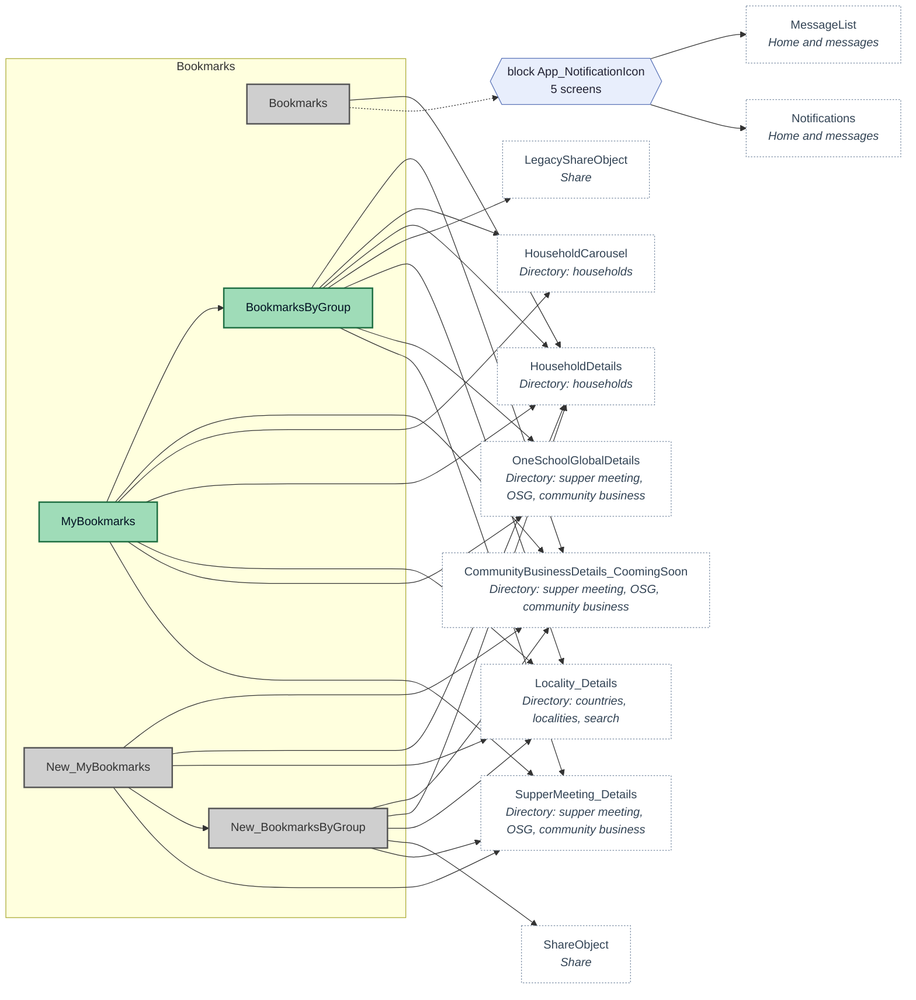
```mermaid
flowchart LR
  classDef build fill:#9fdcb8,stroke:#1f6f43,color:#012,stroke-width:2px
  classDef skip fill:#cfcfcf,stroke:#555555,color:#333,stroke-width:2px
  classDef pbuild fill:#e3f5ea,stroke:#2e8b57,color:#123,stroke-dasharray:4 3
  classDef decide fill:#fff1c9,stroke:#c99700,color:#321,stroke-dasharray:4 3
  classDef pskip fill:#f2f2f2,stroke:#999999,color:#666,stroke-dasharray:4 3
  classDef ext fill:#ffffff,stroke:#7a8ca3,color:#345,stroke-dasharray:2 2
  classDef hub fill:#e8eefc,stroke:#5b74b8,color:#223
  subgraph AREA["Bookmarks"]
    Bookmarks["Bookmarks"]:::skip
    BookmarksByGroup["BookmarksByGroup"]:::build
    MyBookmarks["MyBookmarks"]:::build
    New_BookmarksByGroup["New_BookmarksByGroup"]:::skip
    New_MyBookmarks["New_MyBookmarks"]:::skip
  end
  CommunityBusinessDetails_CoomingSoon["CommunityBusinessDetails_CoomingSoon<br/><i>Directory: supper meeting, OSG, community business</i>"]:::ext
  HouseholdCarousel["HouseholdCarousel<br/><i>Directory: households</i>"]:::ext
  HouseholdDetails["HouseholdDetails<br/><i>Directory: households</i>"]:::ext
  LegacyShareObject["LegacyShareObject<br/><i>Share</i>"]:::ext
  Locality_Details["Locality_Details<br/><i>Directory: countries, localities, search</i>"]:::ext
  MessageList["MessageList<br/><i>Home and messages</i>"]:::ext
  Notifications["Notifications<br/><i>Home and messages</i>"]:::ext
  OneSchoolGlobalDetails["OneSchoolGlobalDetails<br/><i>Directory: supper meeting, OSG, community business</i>"]:::ext
  ShareObject["ShareObject<br/><i>Share</i>"]:::ext
  SupperMeeting_Details["SupperMeeting_Details<br/><i>Directory: supper meeting, OSG, community business</i>"]:::ext
  H0{{"block App_NotificationIcon<br/>5 screens"}}:::hub
  Bookmarks --> HouseholdDetails
  Bookmarks -.-> H0
  BookmarksByGroup --> CommunityBusinessDetails_CoomingSoon
  BookmarksByGroup --> HouseholdCarousel
  BookmarksByGroup --> HouseholdDetails
  BookmarksByGroup --> LegacyShareObject
  BookmarksByGroup --> Locality_Details
  BookmarksByGroup --> OneSchoolGlobalDetails
  BookmarksByGroup --> SupperMeeting_Details
  MyBookmarks --> BookmarksByGroup
  MyBookmarks --> CommunityBusinessDetails_CoomingSoon
  MyBookmarks --> HouseholdCarousel
  MyBookmarks --> HouseholdDetails
  MyBookmarks --> Locality_Details
  MyBookmarks --> OneSchoolGlobalDetails
  MyBookmarks --> SupperMeeting_Details
  New_BookmarksByGroup --> CommunityBusinessDetails_CoomingSoon
  New_BookmarksByGroup --> HouseholdDetails
  New_BookmarksByGroup --> Locality_Details
  New_BookmarksByGroup --> ShareObject
  New_BookmarksByGroup --> SupperMeeting_Details
  New_MyBookmarks --> CommunityBusinessDetails_CoomingSoon
  New_MyBookmarks --> HouseholdDetails
  New_MyBookmarks --> Locality_Details
  New_MyBookmarks --> New_BookmarksByGroup
  New_MyBookmarks --> SupperMeeting_Details
  H0 --> MessageList
  H0 --> Notifications
```

## 9. Orbit

Opened from other areas: Home and messages (7).

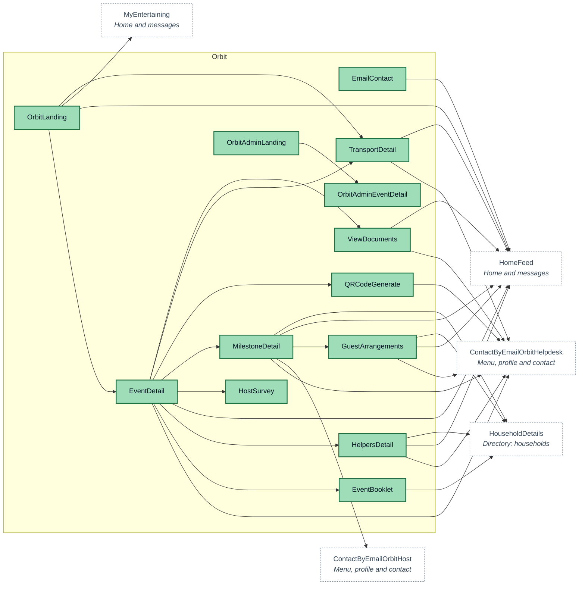
```mermaid
flowchart LR
  classDef build fill:#9fdcb8,stroke:#1f6f43,color:#012,stroke-width:2px
  classDef skip fill:#cfcfcf,stroke:#555555,color:#333,stroke-width:2px
  classDef pbuild fill:#e3f5ea,stroke:#2e8b57,color:#123,stroke-dasharray:4 3
  classDef decide fill:#fff1c9,stroke:#c99700,color:#321,stroke-dasharray:4 3
  classDef pskip fill:#f2f2f2,stroke:#999999,color:#666,stroke-dasharray:4 3
  classDef ext fill:#ffffff,stroke:#7a8ca3,color:#345,stroke-dasharray:2 2
  classDef hub fill:#e8eefc,stroke:#5b74b8,color:#223
  subgraph AREA["Orbit"]
    EmailContact["EmailContact"]:::build
    EventBooklet["EventBooklet"]:::build
    EventDetail["EventDetail"]:::build
    GuestArrangements["GuestArrangements"]:::build
    HelpersDetail["HelpersDetail"]:::build
    HostSurvey["HostSurvey"]:::build
    MilestoneDetail["MilestoneDetail"]:::build
    OrbitAdminEventDetail["OrbitAdminEventDetail"]:::build
    OrbitAdminLanding["OrbitAdminLanding"]:::build
    OrbitLanding["OrbitLanding"]:::build
    QRCodeGenerate["QRCodeGenerate"]:::build
    TransportDetail["TransportDetail"]:::build
    ViewDocuments["ViewDocuments"]:::build
  end
  ContactByEmailOrbitHelpdesk["ContactByEmailOrbitHelpdesk<br/><i>Menu, profile and contact</i>"]:::ext
  ContactByEmailOrbitHost["ContactByEmailOrbitHost<br/><i>Menu, profile and contact</i>"]:::ext
  HomeFeed["HomeFeed<br/><i>Home and messages</i>"]:::ext
  HouseholdDetails["HouseholdDetails<br/><i>Directory: households</i>"]:::ext
  MyEntertaining["MyEntertaining<br/><i>Home and messages</i>"]:::ext
  EmailContact --> HomeFeed
  EventBooklet --> HouseholdDetails
  EventDetail --> ContactByEmailOrbitHelpdesk
  EventDetail --> EventBooklet
  EventDetail --> HelpersDetail
  EventDetail --> HomeFeed
  EventDetail --> HostSurvey
  EventDetail --> MilestoneDetail
  EventDetail --> QRCodeGenerate
  EventDetail --> TransportDetail
  EventDetail --> ViewDocuments
  GuestArrangements --> ContactByEmailOrbitHelpdesk
  GuestArrangements --> HomeFeed
  GuestArrangements --> HouseholdDetails
  HelpersDetail --> ContactByEmailOrbitHelpdesk
  HelpersDetail --> HomeFeed
  HelpersDetail --> HouseholdDetails
  MilestoneDetail --> ContactByEmailOrbitHelpdesk
  MilestoneDetail --> ContactByEmailOrbitHost
  MilestoneDetail --> GuestArrangements
  MilestoneDetail --> HomeFeed
  MilestoneDetail --> HouseholdDetails
  OrbitAdminLanding --> OrbitAdminEventDetail
  OrbitLanding --> EventDetail
  OrbitLanding --> HomeFeed
  OrbitLanding --> MyEntertaining
  OrbitLanding --> TransportDetail
  QRCodeGenerate --> ContactByEmailOrbitHelpdesk
  TransportDetail --> ContactByEmailOrbitHelpdesk
  TransportDetail --> HomeFeed
  ViewDocuments --> ContactByEmailOrbitHelpdesk
  ViewDocuments --> HomeFeed
```

## 10. LDM

Opened from other areas: Home and messages (8).

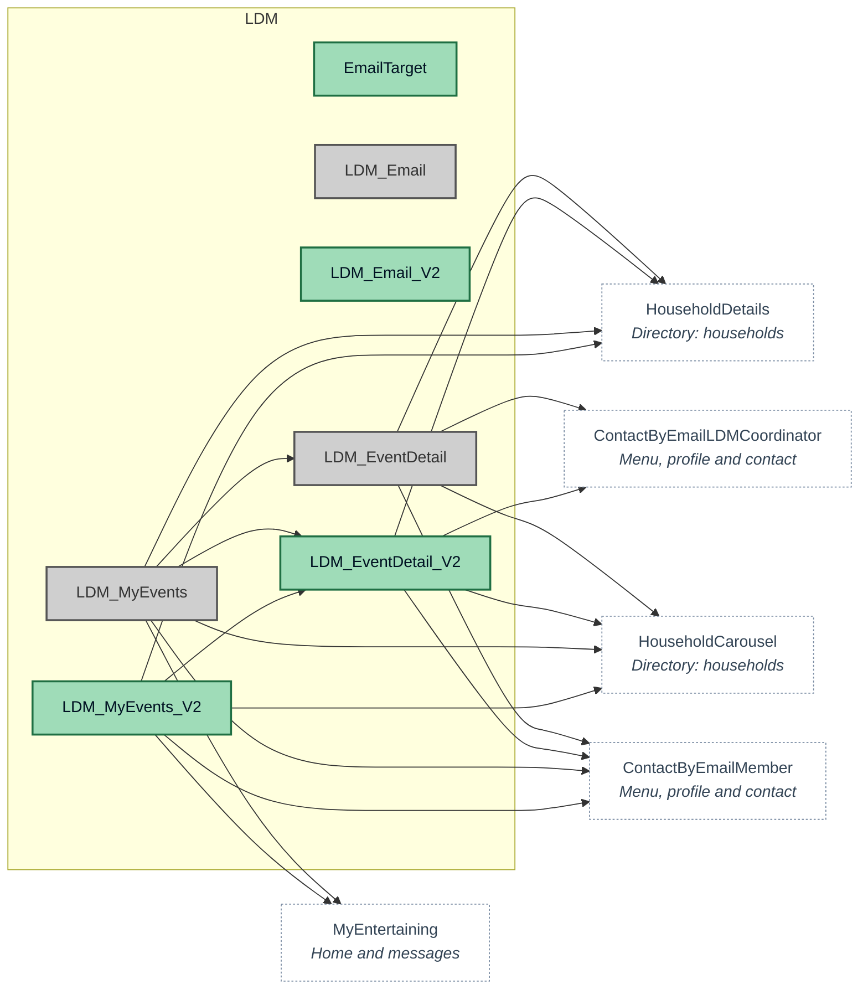
```mermaid
flowchart LR
  classDef build fill:#9fdcb8,stroke:#1f6f43,color:#012,stroke-width:2px
  classDef skip fill:#cfcfcf,stroke:#555555,color:#333,stroke-width:2px
  classDef pbuild fill:#e3f5ea,stroke:#2e8b57,color:#123,stroke-dasharray:4 3
  classDef decide fill:#fff1c9,stroke:#c99700,color:#321,stroke-dasharray:4 3
  classDef pskip fill:#f2f2f2,stroke:#999999,color:#666,stroke-dasharray:4 3
  classDef ext fill:#ffffff,stroke:#7a8ca3,color:#345,stroke-dasharray:2 2
  classDef hub fill:#e8eefc,stroke:#5b74b8,color:#223
  subgraph AREA["LDM"]
    EmailTarget["EmailTarget"]:::build
    LDM_Email["LDM_Email"]:::skip
    LDM_Email_V2["LDM_Email_V2"]:::build
    LDM_EventDetail["LDM_EventDetail"]:::skip
    LDM_EventDetail_V2["LDM_EventDetail_V2"]:::build
    LDM_MyEvents["LDM_MyEvents"]:::skip
    LDM_MyEvents_V2["LDM_MyEvents_V2"]:::build
  end
  ContactByEmailLDMCoordinator["ContactByEmailLDMCoordinator<br/><i>Menu, profile and contact</i>"]:::ext
  ContactByEmailMember["ContactByEmailMember<br/><i>Menu, profile and contact</i>"]:::ext
  HouseholdCarousel["HouseholdCarousel<br/><i>Directory: households</i>"]:::ext
  HouseholdDetails["HouseholdDetails<br/><i>Directory: households</i>"]:::ext
  MyEntertaining["MyEntertaining<br/><i>Home and messages</i>"]:::ext
  LDM_EventDetail --> ContactByEmailLDMCoordinator
  LDM_EventDetail --> ContactByEmailMember
  LDM_EventDetail --> HouseholdCarousel
  LDM_EventDetail --> HouseholdDetails
  LDM_EventDetail_V2 --> ContactByEmailLDMCoordinator
  LDM_EventDetail_V2 --> ContactByEmailMember
  LDM_EventDetail_V2 --> HouseholdCarousel
  LDM_EventDetail_V2 --> HouseholdDetails
  LDM_MyEvents --> ContactByEmailMember
  LDM_MyEvents --> HouseholdCarousel
  LDM_MyEvents --> HouseholdDetails
  LDM_MyEvents --> LDM_EventDetail
  LDM_MyEvents --> LDM_EventDetail_V2
  LDM_MyEvents --> MyEntertaining
  LDM_MyEvents_V2 --> ContactByEmailMember
  LDM_MyEvents_V2 --> HouseholdCarousel
  LDM_MyEvents_V2 --> HouseholdDetails
  LDM_MyEvents_V2 --> LDM_EventDetail_V2
  LDM_MyEvents_V2 --> MyEntertaining
```

## 11. Assemble

Opened from other areas: Home and messages (3).

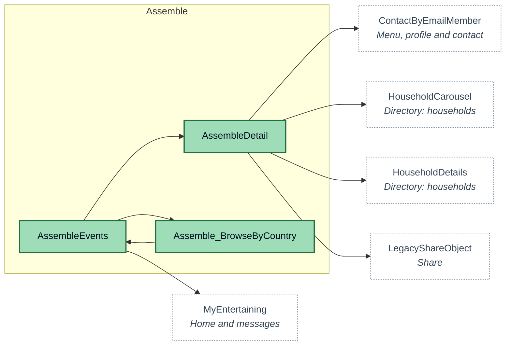
```mermaid
flowchart LR
  classDef build fill:#9fdcb8,stroke:#1f6f43,color:#012,stroke-width:2px
  classDef skip fill:#cfcfcf,stroke:#555555,color:#333,stroke-width:2px
  classDef pbuild fill:#e3f5ea,stroke:#2e8b57,color:#123,stroke-dasharray:4 3
  classDef decide fill:#fff1c9,stroke:#c99700,color:#321,stroke-dasharray:4 3
  classDef pskip fill:#f2f2f2,stroke:#999999,color:#666,stroke-dasharray:4 3
  classDef ext fill:#ffffff,stroke:#7a8ca3,color:#345,stroke-dasharray:2 2
  classDef hub fill:#e8eefc,stroke:#5b74b8,color:#223
  subgraph AREA["Assemble"]
    AssembleDetail["AssembleDetail"]:::build
    AssembleEvents["AssembleEvents"]:::build
    Assemble_BrowseByCountry["Assemble_BrowseByCountry"]:::build
  end
  ContactByEmailMember["ContactByEmailMember<br/><i>Menu, profile and contact</i>"]:::ext
  HouseholdCarousel["HouseholdCarousel<br/><i>Directory: households</i>"]:::ext
  HouseholdDetails["HouseholdDetails<br/><i>Directory: households</i>"]:::ext
  LegacyShareObject["LegacyShareObject<br/><i>Share</i>"]:::ext
  MyEntertaining["MyEntertaining<br/><i>Home and messages</i>"]:::ext
  AssembleDetail --> ContactByEmailMember
  AssembleDetail --> HouseholdCarousel
  AssembleDetail --> HouseholdDetails
  AssembleDetail --> LegacyShareObject
  AssembleEvents --> AssembleDetail
  AssembleEvents --> Assemble_BrowseByCountry
  AssembleEvents --> MyEntertaining
  Assemble_BrowseByCountry --> AssembleEvents
```

## 12. Menu, profile and contact

Opened from other areas: Orbit (8), Directory: supper meeting, OSG, community business (7), Directory: households (6), LDM (6), Start and sign-in (5), Directory: countries, localities, search (5), Assemble (1).

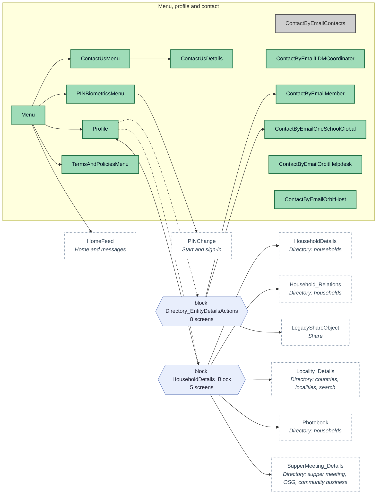
```mermaid
flowchart LR
  classDef build fill:#9fdcb8,stroke:#1f6f43,color:#012,stroke-width:2px
  classDef skip fill:#cfcfcf,stroke:#555555,color:#333,stroke-width:2px
  classDef pbuild fill:#e3f5ea,stroke:#2e8b57,color:#123,stroke-dasharray:4 3
  classDef decide fill:#fff1c9,stroke:#c99700,color:#321,stroke-dasharray:4 3
  classDef pskip fill:#f2f2f2,stroke:#999999,color:#666,stroke-dasharray:4 3
  classDef ext fill:#ffffff,stroke:#7a8ca3,color:#345,stroke-dasharray:2 2
  classDef hub fill:#e8eefc,stroke:#5b74b8,color:#223
  subgraph AREA["Menu, profile and contact"]
    ContactByEmailContacts["ContactByEmailContacts"]:::skip
    ContactByEmailLDMCoordinator["ContactByEmailLDMCoordinator"]:::build
    ContactByEmailMember["ContactByEmailMember"]:::build
    ContactByEmailOneSchoolGlobal["ContactByEmailOneSchoolGlobal"]:::build
    ContactByEmailOrbitHelpdesk["ContactByEmailOrbitHelpdesk"]:::build
    ContactByEmailOrbitHost["ContactByEmailOrbitHost"]:::build
    ContactUsDetails["ContactUsDetails"]:::build
    ContactUsMenu["ContactUsMenu"]:::build
    Menu["Menu"]:::build
    PINBiometricsMenu["PINBiometricsMenu"]:::build
    Profile["Profile"]:::build
    TermsAndPoliciesMenu["TermsAndPoliciesMenu"]:::build
  end
  HomeFeed["HomeFeed<br/><i>Home and messages</i>"]:::ext
  HouseholdDetails["HouseholdDetails<br/><i>Directory: households</i>"]:::ext
  Household_Relations["Household_Relations<br/><i>Directory: households</i>"]:::ext
  LegacyShareObject["LegacyShareObject<br/><i>Share</i>"]:::ext
  Locality_Details["Locality_Details<br/><i>Directory: countries, localities, search</i>"]:::ext
  PINChange["PINChange<br/><i>Start and sign-in</i>"]:::ext
  Photobook["Photobook<br/><i>Directory: households</i>"]:::ext
  SupperMeeting_Details["SupperMeeting_Details<br/><i>Directory: supper meeting, OSG, community business</i>"]:::ext
  H0{{"block Directory_EntityDetailsActions<br/>8 screens"}}:::hub
  H1{{"block HouseholdDetails_Block<br/>5 screens"}}:::hub
  ContactUsMenu --> ContactUsDetails
  Menu --> ContactUsMenu
  Menu --> HomeFeed
  Menu --> PINBiometricsMenu
  Menu --> Profile
  Menu --> TermsAndPoliciesMenu
  PINBiometricsMenu --> PINChange
  Profile -.-> H0
  Profile -.-> H1
  H0 --> ContactByEmailMember
  H0 --> ContactByEmailOneSchoolGlobal
  H0 --> LegacyShareObject
  H1 --> HouseholdDetails
  H1 --> Household_Relations
  H1 --> Locality_Details
  H1 --> Photobook
  H1 --> Profile
  H1 --> SupperMeeting_Details
```

## 13. Share

Opened from other areas: Directory: supper meeting, OSG, community business (3), Home and messages (3), Directory: households (2), Directory: countries, localities, search (2), Bookmarks (2), Menu, profile and contact (1), Assemble (1).

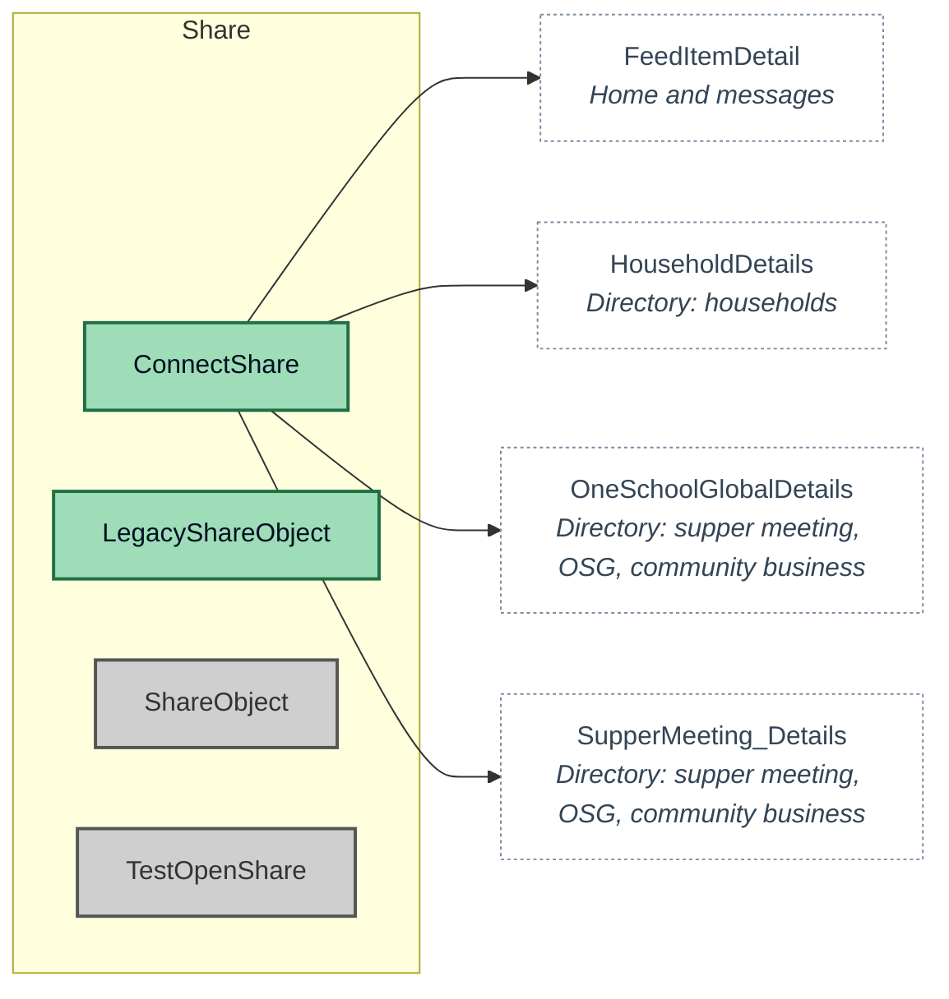
```mermaid
flowchart LR
  classDef build fill:#9fdcb8,stroke:#1f6f43,color:#012,stroke-width:2px
  classDef skip fill:#cfcfcf,stroke:#555555,color:#333,stroke-width:2px
  classDef pbuild fill:#e3f5ea,stroke:#2e8b57,color:#123,stroke-dasharray:4 3
  classDef decide fill:#fff1c9,stroke:#c99700,color:#321,stroke-dasharray:4 3
  classDef pskip fill:#f2f2f2,stroke:#999999,color:#666,stroke-dasharray:4 3
  classDef ext fill:#ffffff,stroke:#7a8ca3,color:#345,stroke-dasharray:2 2
  classDef hub fill:#e8eefc,stroke:#5b74b8,color:#223
  subgraph AREA["Share"]
    ConnectShare["ConnectShare"]:::build
    LegacyShareObject["LegacyShareObject"]:::build
    ShareObject["ShareObject"]:::skip
    TestOpenShare["TestOpenShare"]:::skip
  end
  FeedItemDetail["FeedItemDetail<br/><i>Home and messages</i>"]:::ext
  HouseholdDetails["HouseholdDetails<br/><i>Directory: households</i>"]:::ext
  OneSchoolGlobalDetails["OneSchoolGlobalDetails<br/><i>Directory: supper meeting, OSG, community business</i>"]:::ext
  SupperMeeting_Details["SupperMeeting_Details<br/><i>Directory: supper meeting, OSG, community business</i>"]:::ext
  ConnectShare --> FeedItemDetail
  ConnectShare --> HouseholdDetails
  ConnectShare --> OneSchoolGlobalDetails
  ConnectShare --> SupperMeeting_Details
```

## 14. Deprecated

Opened from other areas: Home and messages (1).

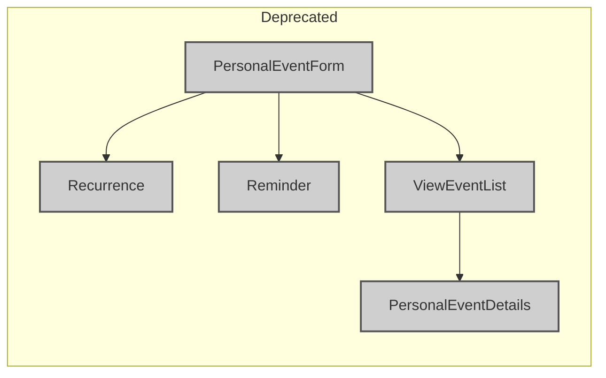
```mermaid
flowchart LR
  classDef build fill:#9fdcb8,stroke:#1f6f43,color:#012,stroke-width:2px
  classDef skip fill:#cfcfcf,stroke:#555555,color:#333,stroke-width:2px
  classDef pbuild fill:#e3f5ea,stroke:#2e8b57,color:#123,stroke-dasharray:4 3
  classDef decide fill:#fff1c9,stroke:#c99700,color:#321,stroke-dasharray:4 3
  classDef pskip fill:#f2f2f2,stroke:#999999,color:#666,stroke-dasharray:4 3
  classDef ext fill:#ffffff,stroke:#7a8ca3,color:#345,stroke-dasharray:2 2
  classDef hub fill:#e8eefc,stroke:#5b74b8,color:#223
  subgraph AREA["Deprecated"]
    PersonalEventDetails["PersonalEventDetails"]:::skip
    PersonalEventForm["PersonalEventForm"]:::skip
    Recurrence["Recurrence"]:::skip
    Reminder["Reminder"]:::skip
    ViewEventList["ViewEventList"]:::skip
  end
  PersonalEventForm --> Recurrence
  PersonalEventForm --> Reminder
  PersonalEventForm --> ViewEventList
  ViewEventList --> PersonalEventDetails
```

## 15. Table: where each screen goes to and comes from (shared frame not counted)

| Screen | Area | Scope | From | To |
|---|---|---|---|---|
| AcceptPendingPolicies | Start and sign-in | build | — | — |
| InvalidPermissions | Start and sign-in | skip | — | Login |
| Login | Start and sign-in | build | InvalidPermissions, MessageDetail, MessageList, PINRegister | ContactUsMenu, HomeFeed, PINRegister |
| PINChange | Start and sign-in | build | PINBiometricsMenu | ContactUsMenu, HomeFeed, Menu |
| PINRegister | Start and sign-in | build | Login, Splash | ContactUsMenu, HomeFeed, Login, Menu |
| PINUnlock | Start and sign-in | build | Splash | — |
| Splash | Start and sign-in | build | — | PINRegister, PINUnlock |
| FeedItemDetail | Home and messages | build | ConnectShare, MessageDetail | LegacyShareObject |
| HomeFeed | Home and messages | build | EmailContact, EventDetail, GuestArrangements, HelpersDetail, Login, Menu, MessageDetail, MilestoneDetail, OrbitLanding, PINChange, PINRegister, TransportDetail, ViewDocuments | AssembleEvents, HouseholdCarousel, HouseholdDetails, LDM_MyEvents, LDM_MyEvents_V2, LegacyShareObject, MessageList, MyEntertaining, Notes, Notifications, OrbitAdminLanding, OrbitLanding, Search, Services, Updates_SingleList |
| MessageDetail | Home and messages | build | MessageList | AssembleDetail, EventDetail, FeedItemDetail, HomeFeed, HostSurvey, HouseholdDetails, LDM_Email, LDM_Email_V2, LDM_EventDetail, LDM_EventDetail_V2, LegacyShareObject, Login, MessageList, MilestoneDetail, Notifications, OneSchoolGlobalDetails, SupperMeeting_Details |
| MessageList | Home and messages | build | Bookmarks, CountryList, HomeFeed, MessageDetail, Notes, Updates_SingleList | Login, MessageDetail |
| MyCalendar | Home and messages | skip | — | AssembleDetail, EventDetail, LDM_EventDetail, LDM_EventDetail_V2, PersonalEventForm, TransportDetail |
| MyEntertaining | Home and messages | build | AssembleEvents, HomeFeed, LDM_MyEvents, LDM_MyEvents_V2, OrbitLanding | — |
| Notes | Home and messages | build | HomeFeed | HouseholdDetails, MessageList, Notifications, OneSchoolGlobalDetails, SupperMeeting_Details |
| Notifications | Home and messages | build | Bookmarks, CountryList, HomeFeed, MessageDetail, Notes, Updates_SingleList | — |
| Services | Home and messages | build | HomeFeed | — |
| BrowseCountries | Directory: countries, localities, search | build | BrowseDirectory | BrowseDirectory |
| BrowseDirectory | Directory: countries, localities, search | build | BrowseCountries, Locality_Details | BrowseCountries, Locality_Details |
| CountryDetails | Directory: countries, localities, search | build | CountryList, Locality_Details, Map | Locality_Details |
| CountryList | Directory: countries, localities, search | build | — | CountryDetails, Locality_Details, MessageList, Notifications, Search, Updates_SingleList |
| Locality_Details | Directory: countries, localities, search | build | BookmarksByGroup, BrowseDirectory, CountryDetails, CountryList, HouseholdCarousel, HouseholdDetails, Map, MyBookmarks, New_BookmarksByGroup, New_MyBookmarks, Profile, Search, SupperMeeting_Carousel | BrowseDirectory, ContactByEmailMember, ContactByEmailOneSchoolGlobal, CountryDetails, HouseholdCarousel, HouseholdDetails, Household_Relations, LegacyShareObject, Map, OneSchoolGlobalDetails, Photobook, Profile, Search, SupperMeeting_Carousel, SupperMeeting_Details |
| Map | Directory: countries, localities, search | skip | Locality_Details | ContactByEmailMember, ContactByEmailOneSchoolGlobal, CountryDetails, HouseholdCarousel, HouseholdDetails, LegacyShareObject, Locality_Details, OneSchoolGlobalDetails, SupperMeeting_Details |
| Search | Directory: countries, localities, search | build | CountryList, HomeFeed, Locality_Details | HouseholdCarousel, HouseholdDetails, Locality_Details |
| Updates_SingleList | Directory: countries, localities, search | build | CountryList, HomeFeed | HouseholdCarousel, HouseholdDetails, MessageList, Notifications |
| HouseholdCarousel | Directory: households | build | AssembleDetail, BookmarksByGroup, HomeFeed, LDM_EventDetail, LDM_EventDetail_V2, LDM_MyEvents, LDM_MyEvents_V2, Locality_Details, Map, MyBookmarks, Photobook, Search, SupperMeeting_Carousel, SupperMeeting_Details, Updates_SingleList | ContactByEmailMember, ContactByEmailOneSchoolGlobal, HouseholdDetails, Household_Relations, LegacyShareObject, Locality_Details, Photobook, Profile, SupperMeeting_Details |
| HouseholdDetails | Directory: households | build | AssembleDetail, Bookmarks, BookmarksByGroup, ConnectShare, EventBooklet, GuestArrangements, HelpersDetail, HomeFeed, HouseholdCarousel, Household_Relations, LDM_EventDetail, LDM_EventDetail_V2, LDM_MyEvents, LDM_MyEvents_V2, Locality_Details, Map, MessageDetail, MilestoneDetail, MyBookmarks, New_BookmarksByGroup, New_MyBookmarks, Notes, Photobook, Profile, Search, SupperMeeting_Carousel, SupperMeeting_Details, Updates_SingleList | ContactByEmailMember, ContactByEmailOneSchoolGlobal, Household_Relations, LegacyShareObject, Locality_Details, Photobook, Profile, SupperMeeting_Details |
| Household_Relations | Directory: households | build | HouseholdCarousel, HouseholdDetails, Locality_Details, Profile, SupperMeeting_Carousel | HouseholdDetails |
| Photobook | Directory: households | build | HouseholdCarousel, HouseholdDetails, Locality_Details, Profile, SupperMeeting_Carousel | HouseholdCarousel, HouseholdDetails |
| CommunityBusinessDetails | Directory: supper meeting, OSG, community business | skip | — | — |
| CommunityBusinessDetails_CoomingSoon | Directory: supper meeting, OSG, community business | build | BookmarksByGroup, MyBookmarks, New_BookmarksByGroup, New_MyBookmarks | — |
| OneSchoolGlobalDetails | Directory: supper meeting, OSG, community business | build | BookmarksByGroup, ConnectShare, Locality_Details, Map, MessageDetail, MyBookmarks, Notes | ContactByEmailMember, ContactByEmailOneSchoolGlobal, LegacyShareObject |
| OneSchoolGlobalEventDetail | Directory: supper meeting, OSG, community business | skip | — | — |
| SupperMeeting_Carousel | Directory: supper meeting, OSG, community business | build | Locality_Details | ContactByEmailMember, ContactByEmailOneSchoolGlobal, HouseholdCarousel, HouseholdDetails, Household_Relations, LegacyShareObject, Locality_Details, Photobook, Profile, SupperMeeting_Details |
| SupperMeeting_Details | Directory: supper meeting, OSG, community business | build | BookmarksByGroup, ConnectShare, HouseholdCarousel, HouseholdDetails, Locality_Details, Map, MessageDetail, MyBookmarks, New_BookmarksByGroup, New_MyBookmarks, Notes, Profile, SupperMeeting_Carousel | ContactByEmailMember, ContactByEmailOneSchoolGlobal, HouseholdCarousel, HouseholdDetails, LegacyShareObject |
| Bookmarks | Bookmarks | skip | — | HouseholdDetails, MessageList, Notifications |
| BookmarksByGroup | Bookmarks | build | MyBookmarks | CommunityBusinessDetails_CoomingSoon, HouseholdCarousel, HouseholdDetails, LegacyShareObject, Locality_Details, OneSchoolGlobalDetails, SupperMeeting_Details |
| MyBookmarks | Bookmarks | build | — | BookmarksByGroup, CommunityBusinessDetails_CoomingSoon, HouseholdCarousel, HouseholdDetails, Locality_Details, OneSchoolGlobalDetails, SupperMeeting_Details |
| New_BookmarksByGroup | Bookmarks | skip | New_MyBookmarks | CommunityBusinessDetails_CoomingSoon, HouseholdDetails, Locality_Details, ShareObject, SupperMeeting_Details |
| New_MyBookmarks | Bookmarks | skip | — | CommunityBusinessDetails_CoomingSoon, HouseholdDetails, Locality_Details, New_BookmarksByGroup, SupperMeeting_Details |
| EmailContact | Orbit | build | — | HomeFeed |
| EventBooklet | Orbit | build | EventDetail | HouseholdDetails |
| EventDetail | Orbit | build | MessageDetail, MyCalendar, OrbitLanding | ContactByEmailOrbitHelpdesk, EventBooklet, HelpersDetail, HomeFeed, HostSurvey, MilestoneDetail, QRCodeGenerate, TransportDetail, ViewDocuments |
| GuestArrangements | Orbit | build | MilestoneDetail | ContactByEmailOrbitHelpdesk, HomeFeed, HouseholdDetails |
| HelpersDetail | Orbit | build | EventDetail | ContactByEmailOrbitHelpdesk, HomeFeed, HouseholdDetails |
| HostSurvey | Orbit | build | EventDetail, MessageDetail | — |
| MilestoneDetail | Orbit | build | EventDetail, MessageDetail | ContactByEmailOrbitHelpdesk, ContactByEmailOrbitHost, GuestArrangements, HomeFeed, HouseholdDetails |
| OrbitAdminEventDetail | Orbit | build | OrbitAdminLanding | — |
| OrbitAdminLanding | Orbit | build | HomeFeed | OrbitAdminEventDetail |
| OrbitLanding | Orbit | build | HomeFeed | EventDetail, HomeFeed, MyEntertaining, TransportDetail |
| QRCodeGenerate | Orbit | build | EventDetail | ContactByEmailOrbitHelpdesk |
| TransportDetail | Orbit | build | EventDetail, MyCalendar, OrbitLanding | ContactByEmailOrbitHelpdesk, HomeFeed |
| ViewDocuments | Orbit | build | EventDetail | ContactByEmailOrbitHelpdesk, HomeFeed |
| EmailTarget | LDM | build | — | — |
| LDM_Email | LDM | skip | MessageDetail | — |
| LDM_Email_V2 | LDM | build | MessageDetail | — |
| LDM_EventDetail | LDM | skip | LDM_MyEvents, MessageDetail, MyCalendar | ContactByEmailLDMCoordinator, ContactByEmailMember, HouseholdCarousel, HouseholdDetails |
| LDM_EventDetail_V2 | LDM | build | LDM_MyEvents, LDM_MyEvents_V2, MessageDetail, MyCalendar | ContactByEmailLDMCoordinator, ContactByEmailMember, HouseholdCarousel, HouseholdDetails |
| LDM_MyEvents | LDM | skip | HomeFeed | ContactByEmailMember, HouseholdCarousel, HouseholdDetails, LDM_EventDetail, LDM_EventDetail_V2, MyEntertaining |
| LDM_MyEvents_V2 | LDM | build | HomeFeed | ContactByEmailMember, HouseholdCarousel, HouseholdDetails, LDM_EventDetail_V2, MyEntertaining |
| AssembleDetail | Assemble | build | AssembleEvents, MessageDetail, MyCalendar | ContactByEmailMember, HouseholdCarousel, HouseholdDetails, LegacyShareObject |
| AssembleEvents | Assemble | build | Assemble_BrowseByCountry, HomeFeed | AssembleDetail, Assemble_BrowseByCountry, MyEntertaining |
| Assemble_BrowseByCountry | Assemble | build | AssembleEvents | AssembleEvents |
| ContactByEmailContacts | Menu, profile and contact | skip | — | — |
| ContactByEmailLDMCoordinator | Menu, profile and contact | build | LDM_EventDetail, LDM_EventDetail_V2 | — |
| ContactByEmailMember | Menu, profile and contact | build | AssembleDetail, HouseholdCarousel, HouseholdDetails, LDM_EventDetail, LDM_EventDetail_V2, LDM_MyEvents, LDM_MyEvents_V2, Locality_Details, Map, OneSchoolGlobalDetails, Profile, SupperMeeting_Carousel, SupperMeeting_Details | — |
| ContactByEmailOneSchoolGlobal | Menu, profile and contact | build | HouseholdCarousel, HouseholdDetails, Locality_Details, Map, OneSchoolGlobalDetails, Profile, SupperMeeting_Carousel, SupperMeeting_Details | — |
| ContactByEmailOrbitHelpdesk | Menu, profile and contact | build | EventDetail, GuestArrangements, HelpersDetail, MilestoneDetail, QRCodeGenerate, TransportDetail, ViewDocuments | — |
| ContactByEmailOrbitHost | Menu, profile and contact | build | MilestoneDetail | — |
| ContactUsDetails | Menu, profile and contact | build | ContactUsMenu | — |
| ContactUsMenu | Menu, profile and contact | build | Login, Menu, PINChange, PINRegister | ContactUsDetails |
| Menu | Menu, profile and contact | build | PINChange, PINRegister | ContactUsMenu, HomeFeed, PINBiometricsMenu, Profile, TermsAndPoliciesMenu |
| PINBiometricsMenu | Menu, profile and contact | build | Menu | PINChange |
| Profile | Menu, profile and contact | build | HouseholdCarousel, HouseholdDetails, Locality_Details, Menu, SupperMeeting_Carousel | ContactByEmailMember, ContactByEmailOneSchoolGlobal, HouseholdDetails, Household_Relations, LegacyShareObject, Locality_Details, Photobook, SupperMeeting_Details |
| TermsAndPoliciesMenu | Menu, profile and contact | build | Menu | — |
| ConnectShare | Share | build | — | FeedItemDetail, HouseholdDetails, OneSchoolGlobalDetails, SupperMeeting_Details |
| LegacyShareObject | Share | build | AssembleDetail, BookmarksByGroup, FeedItemDetail, HomeFeed, HouseholdCarousel, HouseholdDetails, Locality_Details, Map, MessageDetail, OneSchoolGlobalDetails, Profile, SupperMeeting_Carousel, SupperMeeting_Details | — |
| ShareObject | Share | skip | New_BookmarksByGroup | — |
| TestOpenShare | Share | skip | — | — |
| PersonalEventDetails | Deprecated | skip | ViewEventList | — |
| PersonalEventForm | Deprecated | skip | MyCalendar | Recurrence, Reminder, ViewEventList |
| Recurrence | Deprecated | skip | PersonalEventForm | — |
| Reminder | Deprecated | skip | PersonalEventForm | — |
| ViewEventList | Deprecated | skip | PersonalEventForm | PersonalEventDetails |
